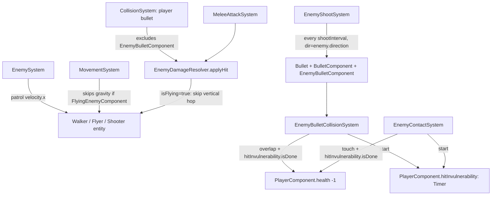

# Requirements

### Overview & Goals
Add two new enemy archetypes on top of the existing patrol-walker enemy: a **flying enemy** (5 HP, same horizontal patrol bounds as the walker but immune to gravity) and a **shooting enemy** (10 HP, patrols like the walker but also fires a bullet every 5 seconds that costs the player one life on hit, just like touching an enemy does).

### Scope
**In scope (this session):**
* A new **flying enemy** type: `5` HP, patrols back-and-forth with the same `patrolRange`/`originX` mechanism as the walker, but is completely unaffected by gravity (hovers at spawn height instead of falling/resting on the ground).
* A new **shooting enemy** type: `10` HP (same as the walker), patrols like the walker (per your decision), and additionally fires a bullet every `5` seconds in whatever direction it's currently facing (no player-aiming/aggro, per your decision).
* Enemy-fired bullets deal damage the same way an enemy's own touch does: on hitting the player, decrement `player.health` by `1` life (gated by the existing `player.hitInvulnerability` grace-period `Timer`, shared with contact damage) — **not** the HP-style `bullet.damage` mechanic used for player bullets hitting enemies.
* Both new types are spawned from Tiled the same way as the existing walker (`type="enemy"` object markers), disambiguated by a new `enemyType` custom string property (`"flyer"` / `"shooter"`; omitted/`"walker"` = today's behavior, so existing map markers are unaffected).
* A fix so a flying enemy's post-hit knockback doesn't launch it permanently upward (since it has no gravity to pull it back down).
* Documentation (`ashley-ecs.md`, `gameplay.md`, `enemies.md`) updated to reflect both new types, per the project's existing documentation-sync rules.

**Out of scope:**
* No player-aiming/aggro/detection logic for the shooter (fires in its current facing/patrol direction only, per your decision).
* No stationary-turret variant (the shooter patrols like the walker, per your decision).
* No new visual assets beyond simple placeholder sprites for the two new enemy types; enemy bullets reuse the existing `gfx/bullet.png` texture (no new bullet art).
* No per-object stat overrides beyond the `enemyType` switch (e.g. no per-marker custom health/speed/shoot-interval overrides yet).
* No changes to the already-implemented walker enemy, `Timer` helper, or the combat/grace-period mechanics from the previous session — this plan only adds the two new enemy archetypes on top of that foundation.

### User Stories
* As a player, I encounter a flying enemy that hovers and patrols a fixed area in the air, taking only 2 melee hits (5+5>5, i.e. dies on the 1st bullet or 1st-2nd melee swing) to defeat since it only has 5 HP.
* As a player, I encounter a shooting enemy that patrols like a regular enemy but also periodically fires a bullet at me, costing me a life if it connects — just like walking into it would.
* As a player, if a shooter's bullet hits me right after I was already hit (by contact or another bullet), I don't lose a second life immediately, since the same grace period protects me from all enemy damage sources.

# Technical Design

### Current Implementation
* `EnemyComponent` (`core/.../ecs/components/EnemyComponent.java`): `float health = 10f`, patrol fields (`speed`, `direction`, `patrolRange`, `originX`), `Timer hitStun`.
* `EnemySystem` (`core/.../ecs/systems/EnemySystem.java`): drives horizontal patrol velocity, flips direction at `patrolRange`/on wall-block/on ledge, pauses entirely while `hitStun` is active. Runs over `Family.all(EnemyComponent, MovementComponent, TransformComponent, CollisionComponent)` at priority `4`.
* `MovementSystem` (priority `5`): applies gravity to every entity in its family (`Transform+Movement+Collision`, excluding bullets) unconditionally — there is currently no way for an entity to opt out of gravity.
* `EnemyDamageResolver` (`core/.../ecs/systems/EnemyDamageResolver.java`): shared static helper used by `PlayerBulletSystem` (bullet hits) and `MeleeAttackSystem` (melee hits) — `applyHit(enemy, movement, damage, knockbackDirection)` applies damage and, on a surviving hit, a `90` u/s horizontal + `140` u/s vertical knockback pop plus a `0.3s` `hitStun`.
* `EnemyContactSystem`/bullet-vs-enemy `PlayerBulletSystem` are the only two damage pipelines today; both are one-directional (player/bullet → enemy, or enemy → player-via-touch). Nothing currently lets an enemy fire a projectile.
* `EntityFactory.createEnemy(x, y)` (private) builds a single hardcoded enemy shape (`gfx/enemy.png`, `EnemyComponent` with `originX = x`); `spawnObjects` calls it unconditionally for every `type="enemy"` Tiled object marker — there's no per-marker type discriminator yet.
* `resources/docs-ai/enemies.md` §3 already documents the intended pattern for this exact situation: "prefer a new marker component (e.g. `ShooterEnemyComponent`, `FlyingEnemyComponent`) layered on top of the base `EnemyComponent`, plus... a dedicated new `IteratingSystem`" — this plan follows that documented convention (confirmed with you for both new types).
* `GameScreen.show()` wires systems with explicit priority constants (`PRIORITY_INPUT=0`, `PRIORITY_ENEMY=4`, `PRIORITY_MOVEMENT=5`, `PRIORITY_COLLISION=6`, `PRIORITY_MELEE/PICKUP/CHEST/ENEMY_CONTACT=7`, `PRIORITY_CAMERA=8`, ...).

### Key Decisions
* **Flying enemy = marker component + `MovementSystem` gravity opt-out (per your decision):** a new `FlyingEnemyComponent` (empty marker, no fields) is checked by `MovementSystem` via a new `FLYING` mapper; if present, the gravity/wall-slide velocity-Y update is skipped entirely for that frame, so the entity holds its spawn height forever. `EnemySystem`'s existing patrol logic (`patrolRange`/`originX`) needs **no changes** — since a flying enemy is never `grounded`, its wall-block/ledge checks (both gated on `movement.grounded`) simply never fire, so it turns around purely via `patrolRange`, matching "similar patrol bounds as the walking one." *Trade-off:* unlike the walker, a flying enemy has no wall-block fallback, so its `patrolRange` must be placed clear of walls by the level designer — acceptable since flying enemies are meant to hover in open space.
* **Shooter enemy patrols like the walker and fires in its facing direction (per your decisions):** shooter entities keep the base `EnemyComponent` (so `EnemySystem` already drives their patrol movement for free, since they still match its family) and additionally get a new `EnemyShooterComponent` (`Timer shootCooldown`, `float shootInterval = 5f`) processed by a new `EnemyShootSystem`. No player-position lookup is needed — the bullet direction is simply `enemy.direction`, keeping the "non-reactive, pure AABB" design philosophy already documented in `enemies.md`.
* **Dedicated enemy-bullet pipeline, symmetric to the player's (per your decision):** a new `EnemyBulletComponent` marker (Poolable, like `BulletComponent`) is attached alongside `BulletComponent` on enemy-fired bullets. The existing `PlayerBulletSystem`'s family gains `.exclude(EnemyBulletComponent.class)`, and a new `EnemyBulletCollisionSystem` mirrors its structure (movement/lifetime/wall-hit) but resolves the "hit" case against the cached player entity instead of the enemy family — keeping each system's `Family` unambiguous (no entity ever matches both) and following the project's existing "split systems by what interacts with what" convention.
* **Enemy bullets damage the player exactly like contact does, not like HP damage:** on hitting the player, `EnemyBulletCollisionSystem` reuses `player.hitInvulnerability` (the *same* `Timer` `EnemyContactSystem` uses) — decrementing `player.health` by `1` only if it `isDone()`, then restarting it for `1.0s`. This means a bullet and a touch share one grace period, per your instruction that the shot should work "similar to being hit by an enemy." `BulletComponent.damage` is left unused/`0` for enemy bullets (the HP-damage field only makes sense for bullets that hit enemies).
* **Flying-enemy knockback needs a small fix:** `EnemyDamageResolver.applyHit` currently always applies a `140` u/s vertical hop on a surviving hit; for a flying enemy (gravity disabled), that velocity would never decay and the enemy would drift upward forever. `applyHit` gains an `isFlying` boolean parameter — when `true`, it skips the vertical hop but keeps the horizontal knockback + `hitStun`. `PlayerBulletSystem`/`MeleeAttackSystem` check the hit enemy's `FLYING` mapper and pass the result through.
* **Enemy type selection via a Tiled custom property, not a new object `type`:** `EntityFactory.spawnObjects` reads an optional `enemyType` string property (`"flyer"` / `"shooter"`, default `"walker"`) off existing `type="enemy"` markers — existing map markers (`enemy1`, `enemy2`) are untouched and keep behaving exactly as today.

### Proposed Changes
1. **`FlyingEnemyComponent`** (new, `core/.../ecs/components/FlyingEnemyComponent.java`): empty marker `Component`, not `Poolable` (created once per entity, like `EnemyComponent`).
2. **`MovementSystem`**: look up `FLYING.get(entity)`; if non-null, skip the `movement.velocity.y += gravity * deltaTime` block entirely (velocity.y stays whatever it already was — `0` at rest).
3. **`EnemyShooterComponent`** (new): `Timer shootCooldown = new Timer()`, `float shootInterval = 5f`.
4. **`EnemyShootSystem`** (new, `IteratingSystem` over `Family.all(EnemyComponent, EnemyShooterComponent, TransformComponent, CollisionComponent)`, priority `4`, same tier as `EnemySystem`): caches a `PooledEngine` in `addedToEngine` (like `PlayerInputSystem`); each frame ticks `shootCooldown`; if `enemy.hitStun.isActive()`, skips firing (mirrors patrol's own stun-pause); otherwise once `shootCooldown.isDone()`, spawns a bullet at the enemy's position traveling horizontally in `enemy.direction` (reusing `gfx/bullet.png`, no gravity — same pattern as `PlayerInputSystem.spawnBullet`), tags it with `EnemyBulletComponent`, and restarts `shootCooldown` via `start(shootInterval)`.
5. **`EnemyBulletComponent`** (new): empty marker `Component, Poolable` (bullets are pooled), no-op `reset()`.
6. **`PlayerBulletSystem`**: family becomes `Family.all(BulletComponent, TransformComponent, MovementComponent, CollisionComponent).exclude(EnemyBulletComponent.class)`, so it never touches enemy-owned bullets.
7. **`EnemyBulletCollisionSystem`** (new, `IteratingSystem` over `Family.all(BulletComponent, EnemyBulletComponent, TransformComponent, MovementComponent, CollisionComponent)`, priority `6`, same tier as `PlayerBulletSystem`): caches the single player entity in `addedToEngine` (mirrors `PickupSystem`); per bullet, ticks `lifetime` (removes on expiry), integrates position, removes on wall overlap (`collisionRects`), and on player overlap **always removes the bullet**, additionally decrementing `player.health` by `1` (clamped at `0`) and restarting `player.hitInvulnerability` for `1.0s` — but only if `hitInvulnerability.isDone()`.
8. **`EnemyDamageResolver.applyHit`**: new `boolean isFlying` parameter; skips the vertical knockback assignment when `true`.
9. **`PlayerBulletSystem`/`MeleeAttackSystem`**: at the enemy-hit call site, compute `boolean isFlying = FLYING.get(hitEnemy) != null;` and pass it into `applyHit(...)`.
10. **`EntityFactory`**: `createEnemy(x, y)` becomes `createEnemy(x, y, String enemyType)`; branches sprite (`gfx/enemy.png` / `gfx/enemy_flyer.png` / `gfx/enemy_shooter.png`) and attaches `FlyingEnemyComponent` (+ `health = 5f`) or `EnemyShooterComponent` accordingly; `spawnObjects`'s `"enemy"` case reads `object.getProperties().get("enemyType", "walker", String.class)` and passes it through.
11. **`Mappers`**: add `FLYING`, `ENEMY_SHOOTER`, `ENEMY_BULLET` `ComponentMapper`s.
12. **`demo_room.tmx`**: add one `enemyType="flyer"` marker in open air (patrol range clear of walls) and one `enemyType="shooter"` marker on solid ground (mirrors an existing walker's placement).
13. **`GameScreen`**: load `gfx/enemy_flyer.png`/`gfx/enemy_shooter.png`, register `EnemyShootSystem` (priority `4`) and `EnemyBulletCollisionSystem` (priority `6`).

### Data Models / Contracts
```java
// FlyingEnemyComponent.java — empty marker, no fields
public class FlyingEnemyComponent implements Component {}

// EnemyShooterComponent.java
public class EnemyShooterComponent implements Component {
    public Timer shootCooldown = new Timer();
    public float shootInterval = 5f;
}

// EnemyBulletComponent.java — empty marker, pooled like BulletComponent
public class EnemyBulletComponent implements Component, Poolable {
    @Override public void reset() {}
}

// EnemyDamageResolver.java (signature change)
static boolean applyHit(EnemyComponent enemy, MovementComponent movement,
                         float damage, int knockbackDirection, boolean isFlying) {
    if (enemy.hitStun.isActive()) return false;
    enemy.health -= damage;
    if (enemy.health <= 0f) return true;
    movement.velocity.x = KNOCKBACK_SPEED_X * knockbackDirection;
    if (!isFlying) {
        movement.velocity.y = KNOCKBACK_SPEED_Y;
    }
    enemy.hitStun.start(HIT_STUN_DURATION);
    return false;
}
```

### Components — key changes
* `FlyingEnemyComponent` (new): empty marker; `MovementSystem` skips gravity when present.
* `EnemyShooterComponent` (new): `Timer shootCooldown`, `float shootInterval = 5f`; drives `EnemyShootSystem`.
* `EnemyBulletComponent` (new): empty marker distinguishing enemy-fired bullets from player-fired ones.
* `EnemyComponent`: no field shape change (flyer overrides `health` to `5f` at spawn time in `EntityFactory`, not via a new default).

### File Structure
```
core/src/main/java/com/axehigh/platformer/
  ecs/components/
    FlyingEnemyComponent.java           (new)
    EnemyShooterComponent.java          (new)
    EnemyBulletComponent.java           (new)
    Mappers.java                        (modified: FLYING, ENEMY_SHOOTER, ENEMY_BULLET)
  ecs/systems/
    EnemyShootSystem.java               (new)
    EnemyBulletCollisionSystem.java     (new)
    MovementSystem.java                 (modified: skip gravity for flyers)
    CollisionSystem.java                (modified: exclude EnemyBulletComponent, isFlying param)
    MeleeAttackSystem.java              (modified: isFlying param)
    EnemyDamageResolver.java            (modified: isFlying param)
  map/
    EntityFactory.java                  (modified: enemyType branching)
  screens/
    GameScreen.java                     (modified: load textures, register 2 new systems)
assets/
  maps/demo_room.tmx                    (modified: 2 new enemy markers)
  gfx/enemy_flyer.png                   (new placeholder)
  gfx/enemy_shooter.png                 (new placeholder)
resources/docs-ai/
  ashley-ecs.md                         (modified)
  gameplay.md                           (modified)
  enemies.md                            (modified)
```

### Architecture Diagram


### Risks
* **Family overlap between the two bullet-collision systems:** if `PlayerBulletSystem` isn't updated to `.exclude(EnemyBulletComponent.class)`, an enemy bullet would match both systems' families and get moved/lifetime-decremented twice per frame — mitigated by making the exclusion part of the same change as introducing `EnemyBulletComponent`.
* **Flying enemy stuck at a wall:** since a flyer's wall-block detection relies on `movement.grounded` (always `false` for it), a flyer whose `patrolRange` includes a wall would have its horizontal velocity zeroed by `MovementSystem` without `EnemySystem` ever flipping its direction, leaving it pressed against the wall — mitigated by placing the new flyer's patrol range in open air on the map (a level-design constraint, not a code gap, per the accepted trade-off above).
* **Forgetting the vertical-knockback fix:** without the `isFlying` parameter on `applyHit`, any hit on a flying enemy would launch it upward forever (no gravity to bring it back down) — called out explicitly as its own delivery stage so it isn't missed.

# Testing

### Validation Approach
No JUnit harness exists in the repo and prior sessions confirmed `:lwjgl3:run` has no usable display in this sandbox, so validation relies on `./gradlew :core:compileJava` succeeding plus structural/logical review of the new code paths (mirroring how enemy placement, passage connectivity, and hit-reaction/ledge logic were validated in earlier sessions).

### Key Scenarios
* Flying enemy: spawns at its marker's Y position and never falls (velocity.y stays `0` across frames since `MovementSystem` skips gravity for it); patrols within `patrolRange` of `originX`.
* Flying enemy health: dies in exactly 1 bullet hit (10 dmg > 5 HP) or 1 melee hit (5 dmg == 5 HP).
* Shooter enemy: patrols exactly like a walker (uses the same `EnemySystem` family/logic) and additionally fires a bullet every `5.0s` in its current `direction`.
* Enemy bullet hits player: `player.health` decrements by exactly `1` and `hitInvulnerability` restarts, only when `hitInvulnerability.isDone()` beforehand; the bullet is removed either way.
* Shared grace period: an enemy-bullet hit immediately after a contact hit (or vice versa) within the same 1.0s window does not stack — both damage sources gate on the same `player.hitInvulnerability` timer.
* Flying-enemy knockback: after a surviving hit, a flyer's `velocity.y` is left untouched (no `140` u/s hop) while its `velocity.x` still gets the horizontal knockback pop.

### Edge Cases
* Enemy bullet expiring mid-flight (`lifetime` elapses with no hit): removed cleanly by `EnemyBulletCollisionSystem`, same as player bullets in `PlayerBulletSystem`.
* Enemy bullet hitting a wall: removed without touching player health, mirroring `PlayerBulletSystem`'s wall-hit behavior for player bullets.
* A shooter enemy stunned (`hitStun` active) right as its `shootCooldown` completes: firing is skipped that frame (per the stun-pause decision), so a stunned shooter doesn't spawn a bullet mid-knockback; the cooldown simply isn't restarted until it's no longer stunned and fires on a later frame.
* Flying enemy with no walls inside its `patrolRange`: turns around purely on the `originX ± patrolRange` bounds check, exactly like a walker's fallback case — verified the new map marker's placement keeps its patrol range clear.

# Delivery Steps

### ✓ Step 1: Add the flying enemy type
A new flying enemy hovers at its spawn height and patrols horizontally like the walker, with 5 HP.

- Add `FlyingEnemyComponent` (empty marker `Component`) in `ecs/components`.
- Add a `FLYING` `ComponentMapper` to `Mappers`.
- In `MovementSystem`, look up `FLYING.get(entity)` and skip the gravity/wall-slide velocity-Y update entirely when present.
- In `EntityFactory`, change `createEnemy(x, y)` to `createEnemy(x, y, String enemyType)`; for `"flyer"`, use a new `gfx/enemy_flyer.png` sprite, set `EnemyComponent.health = 5f`, and attach `FlyingEnemyComponent`.
- In `EntityFactory.spawnObjects`, read the `enemyType` custom property (default `"walker"`) off `"enemy"` markers and pass it through.
- Add a new `enemyType="flyer"` object marker to `demo_room.tmx`, placed in open air with a `patrolRange` clear of walls.
- Load `gfx/enemy_flyer.png` in `GameScreen.show()`.

### ✓ Step 2: Add the shooting enemy type and its firing behavior
A new shooting enemy patrols like the walker (10 HP) and fires a bullet every 5 seconds in its current facing direction.

- Add `EnemyShooterComponent` (`Timer shootCooldown`, `float shootInterval = 5f`) in `ecs/components`, plus an `ENEMY_SHOOTER` mapper in `Mappers`.
- Create `EnemyShootSystem` (`IteratingSystem` over `Family.all(EnemyComponent, EnemyShooterComponent, TransformComponent, CollisionComponent)`): caches a `PooledEngine` in `addedToEngine`; each frame ticks `shootCooldown`, skips firing while `enemy.hitStun.isActive()`, and once `isDone()` spawns a bullet traveling in `enemy.direction` (reusing `gfx/bullet.png`) before restarting the cooldown via `shootInterval`.
- In `EntityFactory`, add the `"shooter"` branch to `createEnemy`: `gfx/enemy_shooter.png` sprite, default `10f` health, attach `EnemyShooterComponent`.
- Add a new `enemyType="shooter"` object marker to `demo_room.tmx` on solid ground, mirroring an existing walker's placement.
- Register `EnemyShootSystem` in `GameScreen.show()` at priority `4` (same tier as `EnemySystem`) and load `gfx/enemy_shooter.png`.

### ✓ Step 3: Make enemy bullets damage the player through a dedicated collision pipeline
A bullet fired by the shooting enemy costs the player one life on hit, sharing the same grace period as enemy-contact damage.

- Add `EnemyBulletComponent` (empty marker `Component, Poolable`) in `ecs/components`, plus an `ENEMY_BULLET` mapper in `Mappers`.
- Tag every bullet spawned by `EnemyShootSystem` with `EnemyBulletComponent` in addition to `BulletComponent`.
- Update `PlayerBulletSystem`'s family to `.exclude(EnemyBulletComponent.class)` so it never processes enemy-owned bullets.
- Create `EnemyBulletCollisionSystem` (`IteratingSystem` over `Family.all(BulletComponent, EnemyBulletComponent, TransformComponent, MovementComponent, CollisionComponent)`): caches the single player entity in `addedToEngine` (mirrors `PickupSystem`); ticks `lifetime`, integrates position, removes the bullet on wall overlap, and on player overlap always removes the bullet, additionally decrementing `player.health` by 1 (clamped at 0) and restarting `player.hitInvulnerability` for 1.0s — only if `hitInvulnerability.isDone()`.
- Register `EnemyBulletCollisionSystem` in `GameScreen.show()` at priority `6` (same tier as `PlayerBulletSystem`).

### ✓ Step 4: Fix flying-enemy knockback to avoid a permanent upward drift
Hitting a flying enemy no longer launches it upward forever, since it has no gravity to pull it back down.

- Add a `boolean isFlying` parameter to `EnemyDamageResolver.applyHit`; when `true`, skip the vertical knockback velocity assignment but keep the horizontal pop and `hitStun`.
- In `PlayerBulletSystem` and `MeleeAttackSystem`, compute `boolean isFlying = FLYING.get(hitEnemy) != null` at the enemy-hit call site and pass it into `applyHit(...)`.

### ✓ Step 5: Sync AI-facing documentation with the two new enemy types
The ECS, gameplay, and enemy-catalog docs accurately describe the flying and shooting enemy types.

- Update `resources/docs-ai/ashley-ecs.md`: add `FlyingEnemyComponent`/`EnemyShooterComponent`/`EnemyBulletComponent` rows, add `EnemyShootSystem`/`EnemyBulletCollisionSystem` rows, update `PlayerBulletSystem`'s family/row, and update the priority-order list.
- Update `resources/docs-ai/gameplay.md`: add new mechanics subsections for flying-enemy movement and enemy shooting/enemy-bullet damage, cross-referencing `enemies.md`.
- Update `resources/docs-ai/enemies.md`: add Flying Enemy (5 HP) and Shooting Enemy (10 HP) catalog rows, describe the `enemyType` Tiled property and marker-component pattern used, and update the open design questions section (aggro remains unused; per-type contact/shot damage still uniform).
