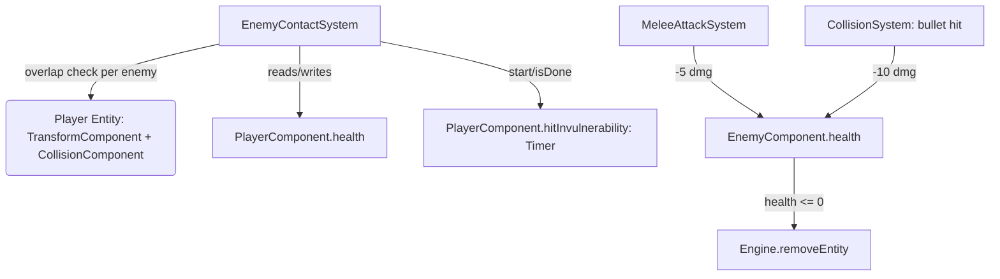

# Requirements

### Overview & Goals
Add real hit-point-based combat resolution between the player and enemies, and introduce a reusable `Timer` helper class to encapsulate the countdown-timer pattern that already exists in several places (`PlayerComponent`, `ChestComponent`) and is now needed again for the player's post-hit grace period.

### Scope
**In scope:**
* Enemies start with `10` hit points (currently `1`).
* Melee (close-combat) strikes deal `5` damage to an enemy.
* Ranged shots (dagger bullets) deal `10` damage to an enemy.
* When an enemy touches the player, the player loses **1 life** (`PlayerComponent.health`).
* After being hit, the player enters a **1.0 second grace period** during which further enemy contact does not reduce health again.
* A new `com.axehigh.platformer.util.Timer` helper class encapsulates "count down from X, know when it's done" logic.
* Existing raw-float timer fields (`shootCooldownTimer`, `meleeCooldownTimer`, `meleeAttackTimer` on `PlayerComponent`; `disappearTimer` on `ChestComponent`) are migrated to use `Timer` for a single consistent pattern, per your decision to migrate all existing timers.
* Documentation (`ashley-ecs.md`, `gameplay.md`, `enemies.md`, `AGENTS.md`) updated to reflect all of the above, per the project's existing documentation-sync rules.

**Out of scope:**
* No game-over/respawn/death handling when `player.health` reaches `0` (health is simply clamped at `0`; this mirrors the current state where no such handling exists at all).
* No visual feedback (flicker/tint) during the invulnerability grace period — only the damage-prevention mechanic itself.
* No per-enemy-type stat overrides (still only one enemy type exists, per `enemies.md`).

### User Stories
* As a player, when I strike an enemy with my melee weapon, it takes meaningful damage (5 HP) and dies in 2 hits from full health.
* As a player, when I shoot an enemy with a dagger, it takes heavier damage (10 HP) and dies in a single hit from full health.
* As a player, if an enemy touches me, I lose one heart, but I get a brief moment where I can't be hit again immediately, so a single sustained overlap (or several enemies at once) doesn't shred my health instantly.

### Functional Requirements
* `EnemyComponent.health` default changes from `1f` to `10f`.
* `MeleeAttackSystem`'s melee damage constant changes from `1f` to `5f`.
* `PlayerInputSystem`'s bullet damage constant changes from `1f` to `10f`.
* A new system detects AABB overlap between any enemy and the player and, if the player's invulnerability `Timer` is not active, decrements `player.health` by `1` (never below `0`) and starts the invulnerability `Timer` for `1.0` second.
* Multiple enemies overlapping the player in the same frame only cost **one** life, not one per overlapping enemy.
* The `Timer` class exposes: start a countdown, tick it down by delta time, and query whether it's still active/done — used identically everywhere a countdown is needed.

# Technical Design

### Current Implementation
* `EnemyComponent` (`core/.../ecs/components/EnemyComponent.java`): `float health = 1f` plus patrol fields (`speed`, `direction`, `patrolRange`, `originX`).
* `PlayerComponent` (`core/.../ecs/components/PlayerComponent.java`): `int health/maxHealth = 3`, plus four raw-`float` countdown fields: `shootCooldownTimer`, `meleeCooldownTimer`, `meleeAttackTimer`.
* `ChestComponent`: raw-`float` `disappearTimer`.
* Damage is currently only ever applied **to enemies**: `CollisionSystem` (bullet hits, `bullet.damage`, currently `1f` from `PlayerInputSystem.BULLET_DAMAGE`) and `MeleeAttackSystem` (`MELEE_DAMAGE = 1f`). There is **no** system today that damages the player from enemy contact.
* Countdown fields today are all hand-rolled: `PlayerInputSystem.processEntity` does `if (timer > 0f) timer -= deltaTime;` for cooldowns; `MeleeAttackSystem`/`AnimationSystem` read `meleeAttackTimer` directly; `ChestSystem.processEntity` does the same pattern for `disappearTimer`.
* Player-vs-entity overlap already has an established pattern in `PickupSystem`: cache the single player entity in `addedToEngine`, then in `processEntity` (iterating the *other* family) build two `Rectangle`s from `TransformComponent.position` + `CollisionComponent.bounds` and call `overlaps()`.
* `GameScreen.show()` wires systems with explicit priority constants (`PRIORITY_INPUT=0`, `PRIORITY_ENEMY=4`, `PRIORITY_MOVEMENT=5`, `PRIORITY_COLLISION=6`, `PRIORITY_MELEE/PICKUP/CHEST=7`, `PRIORITY_CAMERA=8`, ...).

### Key Decisions
* **Timer as a plain embedded object, not a Component:** `Timer` lives in a new `com.axehigh.platformer.util` package as a plain class (not `Poolable`/not an Ashley `Component`), instantiated as a field inside existing components (`new Timer()`), matching how `PlayerComponent`/`ChestComponent`/`EnemyComponent` are already non-poolable, non-trivial data holders. This avoids inventing a new Ashley concept for something that's purely a value-holder.
* **Migrate all existing timer fields (per your decision):** `PlayerComponent.shootCooldownTimer/meleeCooldownTimer/meleeAttackTimer` and `ChestComponent.disappearTimer` become `Timer` instances, so every countdown in the codebase (cooldowns, attack windows, disappear delay, and the new grace period) follows the exact same `start()/update()/isActive()/isDone()` API.
* **New dedicated system for enemy-contact damage** (`EnemyContactSystem`), not folded into `EnemySystem` or `CollisionSystem`: it has a distinct responsibility (player-damage, not enemy-AI or bullet-resolution) and mirrors the existing separation of concerns (`MeleeAttackSystem` vs `CollisionSystem` vs `PickupSystem` are already split by *what* interacts with *what*).
* **Grace-period timer ticked once per frame, not once per enemy:** Since `EnemyContactSystem` iterates the *enemy* family (there can be several enemies, one player), decrementing a shared `player.hitInvulnerability` timer inside `processEntity` would tick it multiple times per frame. Instead, `update(float deltaTime)` is overridden (mirroring `PlayerInputSystem`'s own `update()` override for its touch-request flags) to tick the player's timer exactly once before/after the per-enemy iteration.

### Proposed Changes
1. **New `Timer` helper** (`core/.../util/Timer.java`): `start(float duration)`, `update(float deltaTime)` (clamped at 0, no-op if already done), `isActive()`, `isDone()`, `getRemaining()`, `reset()`.
2. **Combat tuning:**
   * `EnemyComponent.health` default `1f` → `10f`.
   * `MeleeAttackSystem.MELEE_DAMAGE` `1f` → `5f`.
   * `PlayerInputSystem.BULLET_DAMAGE` `1f` → `10f`.
3. **Timer migration:**
   * `PlayerComponent`: `float shootCooldownTimer` → `Timer shootCooldown = new Timer()`; `float meleeCooldownTimer` → `Timer meleeCooldown = new Timer()`; `float meleeAttackTimer` → `Timer meleeAttack = new Timer()`; new `Timer hitInvulnerability = new Timer()`.
   * `ChestComponent`: `float disappearTimer` → `Timer disappearTimer = new Timer()`.
   * `PlayerInputSystem`: replace manual `-= deltaTime` / `> 0f` / `<= 0f` checks with `timer.update(deltaTime)` / `timer.isActive()` / `timer.isDone()`; replace direct assignment (`= SHOOT_COOLDOWN`) with `timer.start(SHOOT_COOLDOWN)`.
   * `MeleeAttackSystem` / `AnimationSystem`: same swap for `meleeAttackTimer` → `meleeAttack`.
   * `ChestSystem` (countdown) and `MeleeAttackSystem` (the `disappearTimer.start(...)` on chest-open): same swap.
4. **New `EnemyContactSystem`** (`core/.../ecs/systems/EnemyContactSystem.java`, `IteratingSystem` over `Family.all(EnemyComponent, TransformComponent, CollisionComponent)`):
   * Caches the single player entity in `addedToEngine` (same pattern as `PickupSystem`).
   * Overrides `update(float deltaTime)`: ticks `player.hitInvulnerability.update(deltaTime)` once, then calls `super.update(deltaTime)` to run `processEntity` per enemy.
   * `processEntity`: builds player/enemy `Rectangle`s from `Transform+Collision`, checks `overlaps()`; if overlapping **and** `player.hitInvulnerability.isDone()`: `player.health = Math.max(0, player.health - 1)` and `player.hitInvulnerability.start(1.0f)`.
5. **Wiring:** `GameScreen.show()` adds `PRIORITY_ENEMY_CONTACT = 7` and registers `new EnemyContactSystem(PRIORITY_ENEMY_CONTACT)` alongside `MeleeAttackSystem`/`PickupSystem`/`ChestSystem` (same tier — order among priority-7 systems isn't meaningful, matching existing doc language).

### Data Models / Contracts
```java
// core/.../util/Timer.java
public class Timer {
    private float remaining = 0f;
    public void start(float duration) { remaining = duration; }
    public void update(float deltaTime) {
        if (remaining > 0f) {
            remaining = Math.max(0f, remaining - deltaTime);
        }
    }
    public boolean isActive() { return remaining > 0f; }
    public boolean isDone() { return remaining <= 0f; }
    public float getRemaining() { return remaining; }
    public void reset() { remaining = 0f; }
}
```

### Components — key changes
* `PlayerComponent`: 3 fields become `Timer`s, +1 new `Timer hitInvulnerability`.
* `ChestComponent`: 1 field becomes a `Timer`.
* `EnemyComponent`: `health` default `1f` → `10f` (no field shape change).

### File Structure
```
core/src/main/java/com/axehigh/platformer/
  util/
    Timer.java                          (new)
  ecs/components/
    PlayerComponent.java                (modified: Timer fields)
    ChestComponent.java                 (modified: Timer field)
    EnemyComponent.java                 (modified: health default)
  ecs/systems/
    EnemyContactSystem.java             (new)
    PlayerInputSystem.java              (modified: Timer usage, BULLET_DAMAGE)
    MeleeAttackSystem.java              (modified: Timer usage, MELEE_DAMAGE)
    ChestSystem.java                    (modified: Timer usage)
    AnimationSystem.java                (modified: Timer usage)
  screens/
    GameScreen.java                     (modified: register EnemyContactSystem)
resources/docs-ai/
  ashley-ecs.md                         (modified)
  gameplay.md                           (modified)
  enemies.md                            (modified)
AGENTS.md                               (modified)
```

### Architecture Diagram


### Risks
* **Shared-timer double-tick:** ticking `hitInvulnerability` inside `processEntity` (once per enemy) instead of once per frame in `update()` would silently break the grace period when 2+ enemies exist near the player — mitigated by the `update()` override design above.
* **`Timer` migration blast radius:** touches 4 systems (`PlayerInputSystem`, `MeleeAttackSystem`, `AnimationSystem`, `ChestSystem`) plus 2 components; each call site will be updated mechanically (same semantics, different API) to keep behavior identical to today except for the new grace-period feature.

# Testing

### Validation Approach
No JUnit harness exists in the repo and prior sessions confirmed `:lwjgl3:run` has no usable display in this sandbox, so validation relies on `./gradlew :core:compileJava` succeeding plus structural/logical review of the new code paths (mirroring how enemy placement and passage connectivity were validated in earlier sessions).

### Key Scenarios
* Enemy hit-point math: full-health enemy (10 HP) dies in exactly 2 melee hits (5+5) or 1 bullet hit (10).
* Enemy-touches-player: overlapping enemy and player with `hitInvulnerability.isDone()` reduces `player.health` by exactly 1 and starts a 1.0s timer.
* Grace period holds: a second overlap check within the same 1.0s window does not reduce health again (`isDone()` returns false until the timer elapses).
* Multiple simultaneous enemies: two enemies overlapping the player in the same frame only cost 1 life total (guarded by the single `update()`-level timer tick plus the `isDone()` check before each hit).
* Health floor: `player.health` never goes below `0` even under repeated hits after grace periods expire.

### Edge Cases
* Player at `health == 0`: further hits are absorbed by `Math.max(0, ...)` without going negative (no crash, no game-over handling — explicitly out of scope).
* Timer migration regression check: shoot/melee cooldowns and the chest disappear delay must behave identically to before (same durations, same gating), just via the new API — verified by re-reading each call site after the mechanical swap.
* Enemy removed same frame it damages the player (e.g., killed by a bullet the same frame it touches the player): Ashley's deferred entity removal means this is a harmless one-frame overlap, consistent with how `CollisionSystem`/`MeleeAttackSystem` already handle simultaneous kill/interaction ordering.

# Delivery Steps

### ✓ Step 1: Add Timer utility class and migrate existing timer fields
A reusable `Timer` countdown helper exists and every current raw-float timer field in the codebase uses it instead of hand-rolled decrement logic.

- Create `core/.../util/Timer.java` with `start(duration)`, `update(deltaTime)`, `isActive()`, `isDone()`, `getRemaining()`, `reset()`.
- Change `PlayerComponent.shootCooldownTimer`/`meleeCooldownTimer`/`meleeAttackTimer` from `float` to `Timer` fields.
- Change `ChestComponent.disappearTimer` from `float` to a `Timer` field.
- Update `PlayerInputSystem` (cooldown gating/starting), `MeleeAttackSystem` (melee attack window + chest disappear start), `AnimationSystem` (melee-attack state check), and `ChestSystem` (disappear countdown) to use the new `Timer` API with identical timing behavior to before.

### ✓ Step 2: Tune enemy and weapon damage values
Enemies start with 10 hit points, melee strikes deal 5 damage, and bullets deal 10 damage.

- Change `EnemyComponent.health` default from `1f` to `10f`.
- Change `MeleeAttackSystem.MELEE_DAMAGE` from `1f` to `5f`.
- Change `PlayerInputSystem.BULLET_DAMAGE` from `1f` to `10f`.
- Confirm existing damage-application code in `CollisionSystem`/`MeleeAttackSystem` needs no other changes since it already reads these constants/fields dynamically.

### ✓ Step 3: Implement enemy-contact damage to the player with a hit-invulnerability grace period
Touching an enemy costs the player one life, then grants a 1-second window where further enemy contact is ignored.

- Add `Timer hitInvulnerability = new Timer()` to `PlayerComponent`.
- Create `EnemyContactSystem` (`IteratingSystem` over the enemy family), caching the single player entity in `addedToEngine` like `PickupSystem` does.
- Override `update(float deltaTime)` to tick `player.hitInvulnerability` exactly once per frame before iterating enemies, avoiding a multi-tick bug when several enemies exist.
- In `processEntity`, check AABB overlap between the enemy and the cached player; on overlap while `hitInvulnerability.isDone()`, decrement `player.health` (clamped at 0) and `start()` a 1.0s grace period.
- Register `EnemyContactSystem` in `GameScreen.show()` at priority `7`, alongside `MeleeAttackSystem`/`PickupSystem`/`ChestSystem`.

### ✓ Step 4: Sync AI-facing documentation with the new combat and timer mechanics
The ECS, gameplay, and enemy-catalog docs accurately describe the new damage values, invulnerability mechanic, and Timer convention.

- Update `resources/docs-ai/ashley-ecs.md`: `PlayerComponent`/`ChestComponent`/`EnemyComponent` table rows (new `Timer` fields, new health default), add an `EnemyContactSystem` row, update the priority-order list.
- Update `resources/docs-ai/gameplay.md`: reflect `Timer`-based fields in §1.A/§1.E, add a new mechanics subsection describing enemy-contact damage + grace period, and note the tuned damage values.
- Update `resources/docs-ai/enemies.md`: bump the catalog table's Health column to 10, add melee/bullet damage-taken figures, and resolve the previously open design question about enemies dealing contact damage to the player (now implemented).
- Add a short coding-convention bullet to `AGENTS.md` recommending `com.axehigh.platformer.util.Timer` for any new cooldown/countdown/grace-period effect.