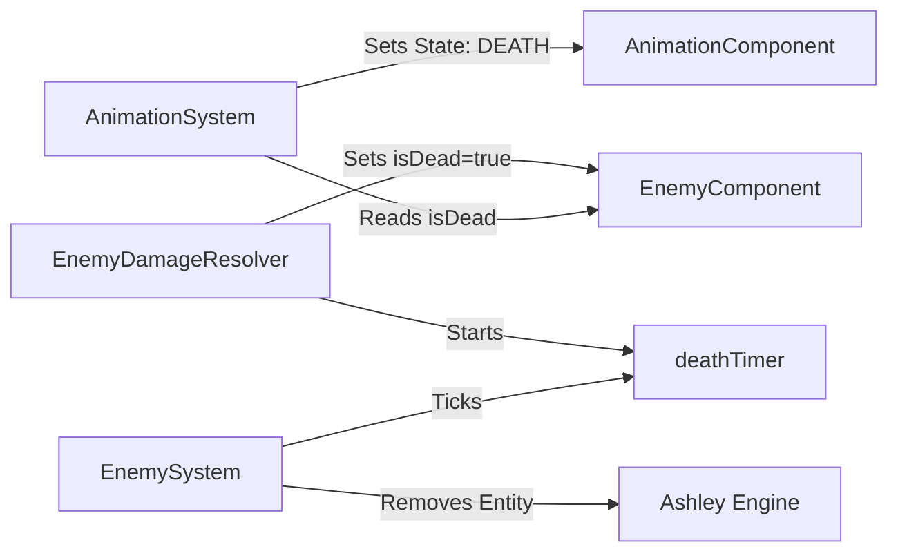

# Requirements

### Overview & Goals
When an enemy is hit, it should transition to the `HURT` animation state. When its health reaches zero, it should transition to the `DEATH` animation state and remain in the game until the animation finishes before being removed.

### Scope
- **In Scope:**
    - Adding `isDead` and `deathTimer` to `EnemyComponent`.
    - Modifying `EnemyDamageResolver` to handle the transition to the death state.
    - Updating `EnemySystem` to handle the removal of dead enemies after their animation ends.
    - Updating `AnimationSystem` to play the `DEATH` animation for dead enemies.
    - Updating combat and AI systems (`EnemyShootSystem`, `EnemyContactSystem`) to ignore dead enemies.
    - Syncing ECS and Gameplay documentation.
- **Out of Scope:**
    - Adding new enemy types or sprites.
    - Sound effects for hit/death.
    - Changing player death behavior.

# Technical Design

### Current Implementation
- Enemies have `health` and `hitStun` in `EnemyComponent`.
- `EnemyDamageResolver` handles damage and knockback, returning `true` if health <= 0.
- Callers (`PlayerBulletSystem`, `MeleeAttackSystem`) immediately remove the enemy entity if `applyHit` returns `true`.
- `AnimationSystem` already handles the `HURT` state when `hitStun` is active.

### Proposed Changes

#### Data Model
- `EnemyComponent`:
    - `isDead`: Boolean flag to prevent multiple death triggers and stop AI/combat.
    - `deathTimer`: A `Timer` instance to track the duration of the death animation.

#### Implementation Details
1.  **EnemyDamageResolver**:
    - Centralizes the death sequence initialization.
    - Stops movement and starts the `deathTimer` based on the `DEATH` animation duration.
2.  **EnemySystem**:
    - Acts as the manager for the enemy lifecycle.
    - Handles the cleanup of dead entities after their timer expires.
3.  **AnimationSystem**:
    - The `resolveEnemyState` logic will prioritize the `DEATH` state over `HURT` and `WALKING`.
4.  **Combat/AI Systems**:
    - `EnemyShootSystem` and `EnemyContactSystem` will ignore entities where `isDead` is true.

### File Structure Changes
- `core/src/.../ecs/components/EnemyComponent.java`: Add fields.
- `core/src/.../ecs/systems/EnemyDamageResolver.java`: Update logic.
- `core/src/.../ecs/systems/EnemySystem.java`: Update lifecycle.
- `core/src/.../ecs/systems/AnimationSystem.java`: Update state resolution.
- `core/src/.../ecs/systems/EnemyShootSystem.java`: Ignore dead enemies.
- `core/src/.../ecs/systems/EnemyContactSystem.java`: Ignore dead enemies.
- `core/src/.../ecs/systems/CollisionSystem.java`: Remove immediate entity deletion.
- `core/src/.../ecs/systems/MeleeAttackSystem.java`: Remove immediate entity deletion.

### Architecture Diagram

# Testing

### Validation Approach
- Verify that hitting an enemy triggers the `HURT` animation (already mostly works via `hitStun`).
- Verify that an enemy with 0 HP enters the `DEATH` animation state.
- Verify that the enemy disappears only after the death animation finishes.
- Verify that a dead enemy does not move, shoot, or damage the player.
- Verify that documentation is correctly synchronized.

### Key Scenarios
- **Scenario 1: Bullet Hit Death**
  1. Player shoots enemy.
  2. Enemy health drops to 0.
  3. Enemy stops moving, plays `DEATH` animation.
  4. Enemy is removed after ~0.5-0.8s.
- **Scenario 2: Melee Hit Death**
  1. Player strikes enemy with sword.
  2. Enemy health drops to 0.
  3. Enemy stops moving, plays `DEATH` animation.
  4. Enemy is removed.
- **Scenario 3: Contact with Dead Enemy**
  1. Enemy is in `DEATH` state.
  2. Player walks into the enemy sprite.
  3. Player should NOT take damage.

# Delivery Steps

### ✓ Step 1: Add death state fields to EnemyComponent
Update `EnemyComponent` to support death state tracking.
- Add `public boolean isDead = false;` field to `EnemyComponent.java`.
- Add `public Timer deathTimer = new Timer();` field to `EnemyComponent.java`.
- Import `com.axehigh.platformer.util.Timer` if not already present.

### ✓ Step 2: Update EnemyDamageResolver and callers for death handling
Update `EnemyDamageResolver` to initiate the death sequence instead of letting callers handle it.
- Modify `applyHit` signature to accept `Entity enemyEntity`.
- Check `if (enemy.isDead) return false;` at the start of `applyHit`.
- When `enemy.health <= 0f`:
    - Set `enemy.isDead = true`.
    - Zero out `movement.velocity` to stop movement immediately.
    - Retrieve `AnimationComponent` from `enemyEntity` via `Mappers.ANIMATION`.
    - Start `enemy.deathTimer` using the duration of the `DEATH` animation (fallback to a default like `0.5s` if missing).
    - Return `true`.
- Update `CollisionSystem.java` and `MeleeAttackSystem.java` to pass the `Entity` to `applyHit` and remove the immediate `removeEntity` calls.

### ✓ Step 3: Implement dead enemy lifecycle in EnemySystem
Update `EnemySystem` to manage the lifecycle of dead enemies.
- In `processEntity`, check `if (enemy.isDead)`.
- If dead:
    - Update `enemy.deathTimer` with `deltaTime`.
    - If `deathTimer.isDone()`, remove the entity from the engine.
    - Return early to skip patrol and movement logic.

### ✓ Step 4: Update Animation and Combat systems for death state
Update other systems to ignore dead enemies and play animations.
- Update `AnimationSystem.resolveEnemyState` to return `AnimationComponent.State.DEATH` when `enemy.isDead` is true.
- Update `EnemyShootSystem.processEntity` to return early if `enemy.isDead`.
- Update `EnemyContactSystem.processEntity` to return early if `enemy.isDead`.

### ✓ Step 5: Synchronize documentation
Update project documentation to reflect the new ECS and gameplay changes.
- Update `resources/docs-ai/ashley-ecs.md` with new `EnemyComponent` fields and system behavior changes.
- Update `resources/docs-ai/gameplay.md` to describe the new enemy death mechanic.
