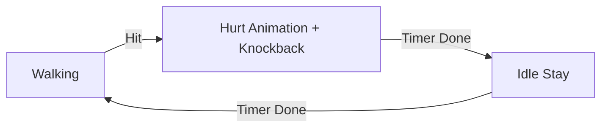

# Requirements

### Overview & Goals
Modify enemy behavior when hit to be more reactive and follow a classic platformer "Hit -> Stun/Hurt -> Idle -> Resume" pattern.

### Functional Requirements
- When an enemy is hit, it must play its **Hurt** animation.
- During the Hurt animation, the enemy must **stop walking** (patrol AI paused).
- After the Hurt animation finishes, the enemy must **stay idle** for a short duration (0.5s).
- After the idle period, the enemy must **resume** its normal patrol behavior.

### Scope
- **In Scope**: `EnemyComponent`, `EnemySystem`, `EnemyDamageResolver`, and `AnimationSystem`.
- **Out of Scope**: Changing player attack mechanics or enemy death sequences.

# Technical Design

### Current Implementation
- `EnemyDamageResolver` applies a fixed 0.3s `hitStun` and knockback.
- `EnemySystem` pauses patrol AI while `hitStun` is active.
- `AnimationSystem` shows `HURT` state while `hitStun` is active.
- There is currently no "idle" phase after `hitStun` ends; the enemy immediately resumes walking.

### Proposed Changes
1. **Dynamic Hit Stun**: `EnemyDamageResolver` will now read the duration of the `HURT` animation from `AnimationComponent` to set the `hitStun` timer, ensuring the full animation plays out while the enemy is stunned.
2. **Post-Hit Idle State**: Introduce a new `postHitIdle` timer in `EnemyComponent`.
3. **State Transition**: `EnemySystem` will monitor `hitStun`. When it finishes, it will trigger the `postHitIdle` timer for 0.5 seconds.
4. **Behavior during Idle**: While `postHitIdle` is active, `EnemySystem` will keep the enemy stationary (velocity zeroed) and `AnimationSystem` will show the `IDLE` state.

### File Changes
- `EnemyComponent.java`: Add `postHitIdle` timer.
- `EnemyDamageResolver.java`: Update `applyHit` to use animation duration and reset idle timer.
- `EnemySystem.java`: Handle timer updates and transition logic; pause movement during idle.
- `AnimationSystem.java`: Resolve `IDLE` state during the post-hit period.

### Logic Flow

# Testing

### Validation Approach
I will verify the change by inspecting the logic in the affected systems and ensuring the state transitions are correctly handled via the new timer.

### Key Scenarios
1. **Melee Hit**: Player strikes enemy -> Enemy bounces back with Hurt animation -> Enemy stops for 0.5s -> Enemy resumes walking.
2. **Projectile Hit**: Bullet hits enemy -> Same sequence as above.
3. **Multi-Hit**: Hitting an enemy while it is in the post-hit idle period should reset the cycle (go back to Hurt animation).

### Edge Cases
- **Flying Enemies**: Should not have their vertical bobbing affected by the post-hit idle if they are still "airborne", or should they? The task says "stay idle", usually this means stationary. I will zero out horizontal velocity. If flying, maybe zero out vertical too to truly "stay idle".
- **Death**: Hits that result in death should skip the idle phase and go straight to the death sequence (already handled by `EnemyDamageResolver` returning early).

# Delivery Steps

### ✓ Step 1: Add post-hit idle timer to EnemyComponent
Add a new `Timer` field to `EnemyComponent` to track the idle period after taking damage.
- Open `core/src/main/java/com/axehigh/platformer/ecs/components/EnemyComponent.java`.
- Add `public final Timer postHitIdle = new Timer();` to the class.

### ✓ Step 2: Update EnemyDamageResolver for dynamic hit stun and timer management
Modify the hit resolution logic to use the `HURT` animation duration and manage the new idle timer.
- Open `core/src/main/java/com/axehigh/platformer/ecs/systems/EnemyDamageResolver.java`.
- Define a constant `POST_HIT_IDLE_DURATION = 0.5f`.
- Update `applyHit` to calculate `hitStun` duration from the `HURT` animation via `AnimationComponent` if present.
- Call `enemy.postHitIdle.reset()` when a hit is applied to ensure clean state transitions.

### ✓ Step 3: Update EnemySystem to handle post-hit transitions and idle state
Update the enemy AI to handle the transition between hit stun and idle, and pause patrol during the idle period.
- Open `core/src/main/java/com/axehigh/platformer/ecs/systems/EnemySystem.java`.
- In `processEntity`, update the `postHitIdle` timer.
- Add logic to start `postHitIdle` when `hitStun` just finished (was active last frame, now done).
- Add a check for `enemy.postHitIdle.isActive()` to zero out horizontal velocity and skip patrol logic.

### ✓ Step 4: Update AnimationSystem to show Idle during post-hit period
Ensure the enemy displays the idle animation during the post-hit idle period.
- Open `core/src/main/java/com/axehigh/platformer/ecs/systems/AnimationSystem.java`.
- Update `resolveEnemyState` to return `AnimationComponent.State.IDLE` when `enemy.postHitIdle.isActive()`.