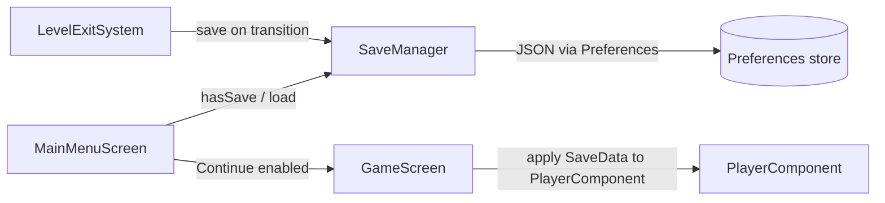
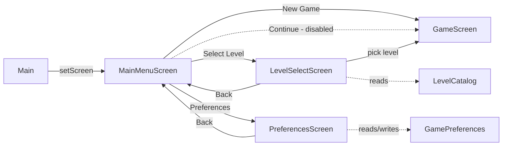
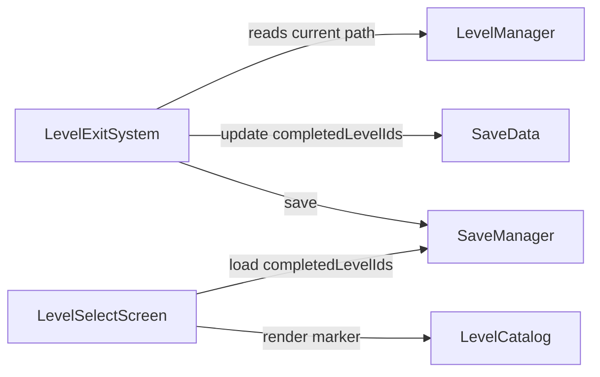
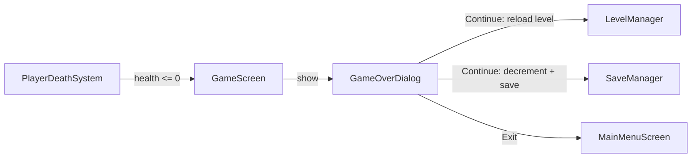

# Requirements (Save/Continue)

### Overview & Goals
Add a real save/continue system so `Continue` on `MainMenuScreen` (currently permanently disabled) becomes functional: the current level plus the player's core stats and upgrades are autosaved whenever the player passes through a level-exit gate, and can be resumed later.

### Scope
**In Scope**
- Autosave triggered from `LevelExitSystem`'s existing gate-transition flow (right when `LevelManager.loadLevel(...)` is invoked), capturing: current/next level path, `health`, `maxHealth`, `coins`, `items`, `swordDamage`, `sharpEdgePurchased`, `daggerBandolierPurchased`, `ironHeartCount`.
- A `SaveData` POJO serialized with libGDX `Json` and stored as a single string value inside the existing settings `Preferences` store, managed by a new `SaveManager` util class.
- `MainMenuScreen`'s `Continue` button becomes enabled/clickable only when `SaveManager.hasSave()` is true; otherwise it stays disabled exactly as today.
- `GameScreen` gains a save-aware construction path so, on Continue, the freshly created player entity's `PlayerComponent` fields are overwritten from the loaded `SaveData` after `entityFactory.createPlayer(...)`.

**Out of Scope**
- Persisting exact player x/y position, transient state (`jumpCount`, `isWallClimbing`, cooldown `Timer`s) — Continue always resumes at the level's spawn point, per your decision ("Level + core stats").
- Multiple save slots — a single save is overwritten on every autosave.
- Manual save UI (pause-menu "Save" button) or periodic/timed autosave — only the level-exit trigger is implemented.

### User Stories
- As a player, I want my progress (level, health, coins, items, upgrades) to be saved automatically when I move to a new level, so I don't lose progress if I quit.
- As a player, I want the Continue button to only be clickable when there's actually a save to resume, so I'm not misled into thinking it will do something when there's nothing saved.
- As a player, when I hit Continue, I want to resume on the level I last reached with my stats/upgrades intact.

### Functional Requirements
- Every time `LevelExitSystem.processEntity(...)` triggers a level transition (player interacts at an exit gate), a `SaveData` snapshot (next level path + current `PlayerComponent` core stats) is written via `SaveManager.save(...)` immediately before/alongside `LevelManager.loadLevel(...)`.
- `MainMenuScreen.show()`/construction checks `SaveManager.hasSave()`; if true, the `Continue` button is enabled (`Touchable.enabled`, normal color) and its `ChangeListener` calls `game.setScreen(new GameScreen(game, saveData))`; if false, it stays disabled exactly as today.
- `GameScreen(Game game, SaveData saveData)` loads `saveData.levelPath` as the level and, after creating the player entity, copies `saveData`'s stat fields onto the new entity's `PlayerComponent` before the engine starts running.
- Existing `GameScreen(Game game)` / `GameScreen(Game game, String levelPath)` (New Game / Select Level) construction paths are unaffected and never touch save data.

# Technical Design (Save/Continue)

### Current Implementation (relevant to save/continue)
- `PlayerComponent` already tracks all the stats to persist: `health`, `maxHealth`, `coins`, `items`, `swordDamage`, `sharpEdgePurchased`, `daggerBandolierPurchased`, `ironHeartCount`.
- `LevelExitSystem.processEntity(...)` is the single choke point where a level transition happens: on interact-while-near-exit it calls `levelManager.loadLevel(levelExit.nextLevelPath, playerEntity)` — this is the autosave trigger point (per your decision).
- `LevelManager.loadLevel(...)` repositions the (same, persisted-in-memory) player entity at the new level's spawn and resets only transient fields (`jumpCount`, `isWallClimbing`, `interactPressed`, `nearExit`) — it never touches disk.
- `GameScreen` currently has two constructors: `GameScreen(Game game)` (defaults to catalog's first level) and `GameScreen(Game game, String levelPath)`; `MainMenuScreen`'s `Continue` button is currently always rendered `Touchable.disabled`.
- `GamePreferences` (`util` package) already wraps a single `Gdx.app.getPreferences("axehigh-platformer-settings")` instance for flat settings (`musicVolume`, `sfxVolume`, `debugMode`) — the new save data will live in the same underlying `Preferences` store, via a separate `SaveManager` class (per your decision), keeping settings and save-game concerns in distinct classes.

### Key Decisions
- **Save trigger**: autosave fires from `LevelExitSystem`, right where it already calls `levelManager.loadLevel(...)` — no new trigger point, no periodic/manual save (per your decision).
- **What's persisted**: level path + `PlayerComponent` core stats only (health/maxHealth/coins/items/swordDamage/upgrade flags/ironHeartCount) — no position, no transient timers/flags; Continue always resumes at the new level's spawn point (per your decision).
- **Storage format**: a `SaveData` POJO serialized to JSON via libGDX `Json`, stored as one string value inside the existing settings `Preferences` (per your decision) — avoids introducing a new file-based persistence mechanism while still giving room to grow the schema later.
- **Ownership**: a new standalone `util.SaveManager` class (parallel to `GamePreferences`), not folded into `LevelManager` — keeps level-transition logic (`LevelManager`) free of persistence concerns and gives `MainMenuScreen`/`LevelExitSystem` one clear place to call for save/load/hasSave (per your decision).
- **Continue enablement**: `MainMenuScreen` calls `SaveManager.hasSave()` at construction time to decide whether `Continue` is `Touchable.enabled` (normal color) or `Touchable.disabled` (dimmed, as today) — never a no-op fallback (per your decision).
- **Applying save to gameplay**: a new `GameScreen(Game game, SaveData saveData)` constructor loads `saveData.levelPath` and, after `entityFactory.createPlayer(...)` builds the player, copies `saveData`'s fields onto that entity's `PlayerComponent` — `EntityFactory.createPlayer(x, y)`'s signature is left untouched (per your decision).

### Proposed Changes
- **New `SaveData`** (`map` package, alongside `LevelDefinition`): a plain POJO with a no-arg constructor (required by libGDX `Json`) and public fields `levelPath`, `health`, `maxHealth`, `coins`, `items`, `swordDamage`, `sharpEdgePurchased`, `daggerBandolierPurchased`, `ironHeartCount`.
- **New `SaveManager`** (`util` package): wraps the same `Preferences` instance used by `GamePreferences` (a shared `Gdx.app.getPreferences("axehigh-platformer-settings")` lookup) and exposes `save(SaveData)` (serializes via `new Json().toJson(data)`, writes to a `"save"` key, `flush()`s), `load()` (reads the key, `new Json().fromJson(SaveData.class, json)`, or `null` if absent), and `hasSave()` (key present and non-empty).
- **`LevelExitSystem`**: on the interact-and-transition branch (right before/alongside `levelManager.loadLevel(...)`), build a `SaveData` from the player's current `PlayerComponent` plus `levelExit.nextLevelPath`, and call `SaveManager.save(saveData)`.
- **`GameScreen`**: add a third constructor `GameScreen(Game game, SaveData saveData)` that sets `levelPath = saveData.levelPath` and stores the `saveData` reference; in `show()`, immediately after `attachPlayerAnimations(player)`/`engine.addEntity(player)`, if a `saveData` is present, overwrite `playerComponent`'s stat fields from it before the first `render()` call.
- **`MainMenuScreen`**: at construction, call `SaveManager.hasSave()`; if true, set the `Continue` button `setTouchable(Touchable.enabled)` with normal (non-dimmed) styling and wire its `ChangeListener` to `game.setScreen(new GameScreen(game, SaveManager.load()))`; if false, leave it exactly as today (dimmed, `Touchable.disabled`, no listener).

### Data Models / Contracts
```java
// map/SaveData.java
public class SaveData {
    public String levelPath;
    public int health;
    public int maxHealth;
    public int coins;
    public int items;
    public int swordDamage;
    public boolean sharpEdgePurchased;
    public boolean daggerBandolierPurchased;
    public int ironHeartCount;
}

// util/SaveManager.java
public final class SaveManager {
    public static boolean hasSave();
    public static void save(SaveData data);
    public static SaveData load(); // null if none
}
```

### Components
- `SaveData` (new, `map` package) — plain serializable snapshot of level + core `PlayerComponent` stats.
- `SaveManager` (new, `util` package) — JSON (de)serialization + `Preferences` read/write/flush, alongside existing `GamePreferences`.
- `LevelExitSystem` (modified) — builds a `SaveData` and calls `SaveManager.save(...)` on every gate-triggered level transition.
- `GameScreen` (modified) — new `SaveData`-aware constructor applies saved stats onto the newly created player entity.
- `MainMenuScreen` (modified) — `Continue` button becomes conditionally enabled based on `SaveManager.hasSave()`.

### File Structure
```
core/src/main/java/com/axehigh/platformer/
  ecs/systems/
    LevelExitSystem.java             (modified: autosave on transition)
  map/
    SaveData.java                    (new)
  screens/
    GameScreen.java                  (modified: SaveData constructor)
    MainMenuScreen.java              (modified: conditional Continue)
  util/
    SaveManager.java                 (new)
```

### Architecture Diagram


### Risks
- If a save references a level path whose `.tmx` no longer exists (e.g. removed asset), `MapLoader` construction in `GameScreen.show()` would fail; acceptable for this scope since the catalog is static and unlikely to shrink, but worth noting.
- Overwriting `PlayerComponent` fields after `attachPlayerAnimations`/`engine.addEntity` but before the first `render()` must happen before any system reads stale defaults (e.g. HUD's initial draw) — sequencing in `show()` matters.

# Technical Design (Menu Screens)

### Current Implementation
- `Main extends Game` and unconditionally calls `setScreen(new GameScreen())` in `create()` — no menu, no screen graph.
- `GameScreen.show()` hardcodes `new MapLoader("maps/demo_room_start.tmx")` — there's no way to choose a level from outside.
- `SkinFactory.createBasicSkin()` builds a minimal programmer-art `Skin` (font, flat-color button drawables, label style) shared today by `HudStage` and `TouchControlsStage` — the same skin/pattern is the natural fit for menu screens.
- No `Preferences`, save, or settings code exists anywhere in the project (confirmed via search) — this is greenfield.
- Existing `.tmx` assets available under `assets/maps/`: `demo_room_start.tmx`, `demo_room.tmx`, `demo_room_final.tmx`, `sample_room.tmx`.

### Key Decisions
- **Navigation**: plain `Game.setScreen(new X(this))` per screen (confirmed with you) — no shared `MenuScreen` base class, matching the project's existing simple single-Game/single-Screen style (`Main`, `GameScreen`).
- **Level catalog**: a small static `LevelDefinition` list (id, display name, `.tmx` path) — recommended default since no level metadata exists today; simplest way to give `Select Level` real content without inventing a progression/locking system.
- **Continue**: kept visible but disabled (`Touchable.disabled` + dimmed color) — per your decision, no save system is introduced in this task.
- **Preferences persistence**: a small `GamePreferences` wrapper around `com.badlogic.gdx.Preferences` (`Gdx.app.getPreferences("axehigh-platformer-settings")`) storing `musicVolume`, `sfxVolume`, `debugMode` as plain floats/boolean — values are stored for future use only; no audio system is wired up (explicitly out of scope).

### Proposed Changes
- **`GameScreen`**: add a constructor parameter `String levelPath` (used instead of the hardcoded `"maps/demo_room_start.tmx"` in `show()`); keep a no-arg constructor that defaults to `LevelCatalog.levels().first().tmxPath` so nothing else breaks.
- **`Main`**: `create()` calls `setScreen(new MainMenuScreen(this))` instead of `new GameScreen()`.
- **New `LevelCatalog`** (`map` package): static `Array<LevelDefinition>` of the four existing maps, exposed via a static getter; `LevelDefinition` is a tiny immutable POJO `{id, displayName, tmxPath}`.
- **New `GamePreferences`** (`util` package, alongside `Timer`): thin wrapper exposing `getMusicVolume()/setMusicVolume()`, `getSfxVolume()/setSfxVolume()`, `isDebugMode()/setDebugMode()`, backed by `Preferences`, calling `.flush()` on every setter.
- **New menu screens** (`screens` package), each independently implementing `Screen` (per the confirmed no-shared-base decision), each owning its own `Stage` + reused `SkinFactory.createBasicSkin()` instance:
  - `MainMenuScreen`: title label + 4 `TextButton`s in a `Table` (`setFillParent(true)`); button `ChangeListener`s call `game.setScreen(...)`.
  - `LevelSelectScreen`: title + a `TextButton` per `LevelDefinition` from `LevelCatalog`, laid out in a `Table`, plus a Back button.
  - `SettingsScreen`: two `Slider`s (music/SFX, 0–100) + one `CheckBox` (debug mode), pre-filled from `GamePreferences`, each with a `ChangeListener` that writes straight back to `GamePreferences`; plus a Back button.
- Each menu screen follows the `HudStage`/`TouchControlsStage` lifecycle conventions already used in `GameScreen`: `Gdx.input.setInputProcessor(stage)` in `show()`, `stage.act/draw` in `render()`, `stage.getViewport().update(w, h, true)` in `resize()`, `stage.dispose()` + `skin.dispose()` in `dispose()`.

### Data Models / Contracts
```java
// map/LevelDefinition.java
public class LevelDefinition {
    public final String id;
    public final String displayName;
    public final String tmxPath;
}

// map/LevelCatalog.java
public final class LevelCatalog {
    public static Array<LevelDefinition> levels(); // e.g. 4 entries backed by assets/maps/*.tmx
}

// util/GamePreferences.java
public class GamePreferences {
    public float getMusicVolume(); public void setMusicVolume(float v);
    public float getSfxVolume();   public void setSfxVolume(float v);
    public boolean isDebugMode();  public void setDebugMode(boolean v);
}
```

### Components
- `MainMenuScreen` (new) — entry screen; New Game / Continue(disabled) / Select Level / Preferences buttons.
- `LevelSelectScreen` (new) — lists `LevelCatalog` entries, launches `GameScreen(levelPath)`.
- `SettingsScreen` (new) — music/SFX sliders + debug checkbox bound to `GamePreferences`.
- `LevelCatalog` / `LevelDefinition` (new, `map` package) — static level metadata.
- `GamePreferences` (new, `util` package) — settings persistence wrapper.
- `GameScreen` (modified) — now takes a level path instead of a hardcoded one.
- `Main` (modified) — boots into `MainMenuScreen`.
- `SkinFactory` (reused, unmodified or lightly extended with a larger "title" label style if needed for menu headings).

### File Structure
```
core/src/main/java/com/axehigh/platformer/
  Main.java                         (modified)
  screens/
    GameScreen.java                 (modified: level path param)
    MainMenuScreen.java              (new)
    LevelSelectScreen.java           (new)
    PreferencesScreen.java           (new)
  map/
    LevelDefinition.java             (new)
    LevelCatalog.java                (new)
  util/
    GamePreferences.java             (new)
```

### Architecture Diagram


### Risks
- This is a menu-only feature; it does not add/change ECS `Component`s or `System`s, so per project convention no update to `ashley-ecs.md`/`enemies.md`/`gameplay.md` is required (no gameplay mechanic changes).
- `GameScreen`'s no-arg constructor must keep working (used implicitly today) to avoid breaking anything referencing it directly — handled by delegating to the parameterized constructor with the catalog's first level.

# Testing

### Validation Approach
Build the project after each stage (`./gradlew :core:compileJava` or full desktop build) and manually trace navigation logic by reading the wired `ChangeListener`s, since this is UI-only Scene2D code without existing automated UI tests in the project.

### Key Scenarios
- App launches into `MainMenuScreen` (not directly into gameplay).
- New Game button transitions to `GameScreen` loaded with the catalog's first level.
- Select Level shows all `LevelCatalog` entries and each one launches `GameScreen` with the correct `.tmx` path.
- Preferences sliders/checkbox reflect previously saved values on re-entry (persisted via `GamePreferences`/`Preferences.flush()`).
- Continue button is visibly present but does not respond to clicks/taps (`Touchable.disabled`).
- Back buttons on Level Select and Preferences correctly return to `MainMenuScreen`.

### Edge Cases
- Resizing the window/rotating on mobile keeps each menu screen's UI aligned (`viewport.update(w, h, true)` in every `resize()`).
- Disposing a menu screen (`dispose()`) properly releases its `Stage` and `Skin` without leaking, matching `GameScreen`'s disposal pattern.
- `GameScreen`'s existing no-arg usage (if any) still compiles and behaves identically after adding the level-path constructor.

# Requirements (Level Progression)

### Overview & Goals
Track which levels have been completed so far, persisting that alongside the existing save, and surface it in `LevelSelectScreen` so the player can see their progress at a glance.

### Scope
**In Scope**
- A level counts as completed the moment the player walks through any of its exit gates (same trigger point `LevelExitSystem` already uses for autosave) — per your decision ("Reaching any exit gate").
- Completion is stored as a set of completed `LevelDefinition` ids (`Array<String> completedLevelIds`) added directly onto the existing `SaveData` POJO, persisted through the same `SaveManager` JSON blob.
- `LevelSelectScreen` appends a "(Completed)" marker to the button text of any level whose id is present in the persisted `completedLevelIds`.

**Out of Scope**
- Distinguishing a "real" level-ending gate from an internal room-to-room transition gate — every gate marks its source level as completed.
- Locking/greying out levels not yet completed — `LevelCatalog` levels remain always selectable, only the label changes.
- A separate progression store independent from the save slot — completion data lives inside `SaveData` and is cleared/reset together with it.

### User Stories
- As a player, I want the game to remember which levels I've already finished, so I can see my progress when picking a level to replay.
- As a player, when I open Select Level, I want completed levels to be visually marked so I know what I've already done.

### Functional Requirements
- `SaveData` gains a `completedLevelIds` field (`Array<String>`, defaulting to empty, never null after deserialization).
- `LevelExitSystem`, at the same point it currently builds a `SaveData` and calls `SaveManager.save(...)`, first loads the existing save's `completedLevelIds` (if any), resolves the *current* level's `LevelDefinition.id` via `LevelManager`'s current tmx path, adds it to the set (no duplicates), and carries the updated set into the new `SaveData` before saving.
- `LevelSelectScreen` reads `SaveManager.load()` (if a save exists) once at construction and, for each `LevelDefinition` whose id is in `completedLevelIds`, renders its button text as `"<displayName> (Completed)"` instead of just `<displayName>`; all buttons remain equally clickable.

# Technical Design (Level Progression)

### Current Implementation (relevant to level progression)
- `LevelCatalog.levels()` returns `LevelDefinition{id, displayName, tmxPath}` entries; ids (`"demo_room_start"`, `"demo_room"`, ...) are the natural key for completion tracking.
- `LevelExitSystem.processEntity(...)` already builds a `SaveData` and calls `SaveManager.save(...)` right before `levelManager.loadLevel(levelExit.nextLevelPath, playerEntity)` — this is the same choke point where completion will be recorded, for the level being *left*.
- `LevelManager` holds a private `mapLoader` but exposes no accessor for the currently active tmx path — needed so `LevelExitSystem` can know which level id is being completed (it only otherwise knows `levelExit.nextLevelPath`, the destination).
- `LevelSelectScreen` currently renders one plain `TextButton` per `LevelCatalog` entry with no completion awareness.

### Key Decisions
- **Completion trigger**: any exit gate a player passes through marks the level being left as completed — reuses the existing `LevelExitSystem` autosave hook, no gate tagging in Tiled required (per your decision).
- **Storage shape**: `completedLevelIds` lives directly on `SaveData` (not a separate store), staying in the same JSON blob `SaveManager` already persists — smallest change, though completion resets if the save slot is ever cleared (accepted per your decision).
- **Display**: `LevelSelectScreen` shows a cosmetic "(Completed)" marker on finished levels; no locking, no separate progress screen (per your decision).

### Proposed Changes
- **`LevelManager`**: add a `getCurrentLevelPath()` getter returning the active `mapLoader`'s source tmx path, so callers can identify which level is currently loaded.
- **`SaveData`**: add `public Array<String> completedLevelIds = new Array<>();`.
- **`LevelExitSystem`**: before calling `SaveManager.save(...)`, load the previous save (if `SaveManager.hasSave()`) to seed `completedLevelIds`, resolve the current level's id by matching `levelManager.getCurrentLevelPath()` against `LevelCatalog.levels()`, add it to the set if not already present, and set the resulting array onto the new `SaveData` before saving.
- **`LevelSelectScreen`**: at construction, call `SaveManager.hasSave() ? SaveManager.load().completedLevelIds : new Array<String>()` once, and for each `LevelDefinition` check membership to decide the button label suffix.

### Data Models / Contracts
```java
// map/SaveData.java (addition)
public class SaveData {
    // ...existing fields...
    public Array<String> completedLevelIds = new Array<>();
}

// map/LevelManager.java (addition)
public String getCurrentLevelPath(); // returns the active mapLoader's tmx path
```

### Components
- `SaveData` (modified) — gains `completedLevelIds`.
- `LevelManager` (modified) — exposes the currently active level's tmx path.
- `LevelExitSystem` (modified) — marks the level being left as completed before saving.
- `LevelSelectScreen` (modified) — shows a "(Completed)" marker per finished level.

### File Structure
```
core/src/main/java/com/axehigh/platformer/
  map/
    SaveData.java                    (modified: completedLevelIds)
    LevelManager.java                (modified: getCurrentLevelPath())
  ecs/systems/
    LevelExitSystem.java             (modified: mark completion before save)
  screens/
    LevelSelectScreen.java           (modified: completed marker)
```

### Architecture Diagram


### Risks
- No ECS `Component`/`System` shape changes (only a new field on a persistence POJO and a getter), so no `ashley-ecs.md`/`gameplay.md`/`enemies.md` update is required per project convention.
- If a level's tmx path isn't found in `LevelCatalog` (e.g. a stray gate pointing at a non-catalog map), the completion lookup simply skips marking anything — no crash.

# Testing (Level Progression)

### Validation Approach
Build with `./gradlew :core:compileJava` and manually trace the updated `LevelExitSystem`/`LevelSelectScreen` logic, consistent with the project's existing manual-verification approach for save/continue.

### Key Scenarios
- Exiting a level's gate adds that level's id to `completedLevelIds` in the persisted `SaveData`, without dropping previously completed ids.
- Re-entering `LevelSelectScreen` after completing one or more levels shows "(Completed)" appended only to those levels' buttons.
- All levels remain clickable regardless of completion status.

### Edge Cases
- Fresh install (no save yet): `LevelSelectScreen` shows no "(Completed)" markers and doesn't crash on a missing save.
- Completing the same level twice (revisiting) does not duplicate its id in `completedLevelIds`.

### ✓ Step 10: Add completedLevelIds to SaveData and expose the current level path from LevelManager
Lay the foundation for progression tracking with no behavior change yet.
- Add `public Array<String> completedLevelIds = new Array<>();` to `SaveData`.
- Add `getCurrentLevelPath()` to `LevelManager`, returning the active `mapLoader`'s source tmx path.
- No systems/screens reference these yet; purely foundational.

### ✓ Step 11: Mark the current level as completed in LevelExitSystem before autosaving
Every gate transition now records progression, not just stats.
- In `LevelExitSystem`, before calling `SaveManager.save(...)`, load the previous save's `completedLevelIds` (if any exists via `SaveManager.hasSave()`), resolve the current level's `LevelDefinition.id` by matching `levelManager.getCurrentLevelPath()` against `LevelCatalog.levels()`, and add it to the set if not already present.
- Carry the resulting `completedLevelIds` array onto the new `SaveData` before calling `SaveManager.save(...)`.
- Verify by exiting a level's gate and inspecting the persisted `Preferences` JSON to confirm the id was added without dropping previously completed ids.

### ✓ Step 12: Show a completed marker on finished levels in LevelSelectScreen
Surface progression to the player in the level picker.
- In `LevelSelectScreen`'s constructor, read `SaveManager.hasSave() ? SaveManager.load().completedLevelIds : new Array<String>()` once.
- For each `LevelDefinition`, render its button text as `"<displayName> (Completed)"` when its id is present in the loaded set, otherwise `<displayName>` as today; all buttons remain equally clickable.
- Manually verify by completing one level, reopening Select Level, and confirming only that level's button shows "(Completed)".

# Requirements (Death / Game Over)

### Overview & Goals
When the player's health reaches 0, gameplay pauses and a Game Over dialog appears on `GameScreen`, letting the player either spend one of their (persisted) 3 tries to restart the current level fresh, or exit to the main menu. Once tries reach 0, only exiting to the main menu is offered.

### Scope
**In Scope**
- A new `PlayerDeathSystem` that detects `player.health <= 0` each frame and triggers a one-time game-over callback (no duplicate triggers while already dead).
- A Game Over overlay (Scene2D `Dialog`) shown directly on `GameScreen`, freezing gameplay (engine update stops), with "Continue (uses 1 try)" and "Exit to Main Menu" buttons.
- `triesRemaining` (default 3) added to `SaveData`, decremented and persisted immediately when "Continue" is chosen; reset to 3 whenever a fresh `SaveData` is created for New Game.
- When `triesRemaining == 0` at the moment of death, the dialog only shows "Exit to Main Menu" (no Continue option at all).
- "Continue" on the dialog reloads the current level from scratch via `LevelManager.loadLevel(...)`, resets `player.health = player.maxHealth`, keeps coins/items/upgrades as-is, and immediately persists the decremented `triesRemaining` via `SaveManager.save(...)`.

**Out of Scope**
- Any UI for the player to see remaining tries during normal gameplay (e.g. a HUD counter) — only surfaced inside the Game Over dialog itself.
- Changing what New-Game/Continue-from-menu do beyond initializing/carrying `triesRemaining` — menu flow itself is otherwise unchanged.
- Any death animation/sound/visual effect on the player entity — this task only covers detection + dialog + retry/exit flow.

### User Stories
- As a player, when my health hits 0, I want gameplay to pause and see a clear Game Over message, so I know what happened.
- As a player, I want the option to retry the current level using one of my 3 tries, so a single mistake doesn't force me back to the main menu immediately.
- As a player, once I've used all 3 tries, I want to be told clearly that I can only return to the main menu, so I understand my run is over.

### Functional Requirements
- `PlayerDeathSystem` (family: player) checks `player.health <= 0` every frame; on the first frame this becomes true, it triggers game-over exactly once (guarded so it doesn't refire every frame while the dialog is open).
- `GameScreen` shows a `Dialog` (via its `hudStage`'s `Skin`) titled "Game Over", pausing `engine.update(...)` while it's visible.
- If `SaveManager.load().triesRemaining > 0` (or a fresh in-memory count if no save yet), the dialog shows both "Continue" and "Exit to Main Menu"; if `triesRemaining == 0`, it shows only "Exit to Main Menu".
- Clicking "Continue": decrements `triesRemaining`, persists it via `SaveManager.save(...)`, calls `levelManager.loadLevel(currentLevelPath, playerEntity)` to restart the level fresh, resets `player.health = player.maxHealth`, hides the dialog, and resumes the engine.
- Clicking "Exit to Main Menu": calls `game.setScreen(new MainMenuScreen(game))`.
- New Game always starts with a fresh `SaveData` where `triesRemaining = 3`; Continue-from-menu resumes with whatever `triesRemaining` was last persisted.

# Technical Design (Death / Game Over)

### Current Implementation (relevant to death/game-over)
- `PlayerComponent.health`/`maxHealth` already exist and are decremented in `EnemyContactSystem`/`EnemyBulletCollisionSystem` (both clamp at `Math.max(0, ...)`), but nothing currently checks for or reacts to `health == 0`.
- `GameScreen.show()` wires up all Ashley systems with explicit `PRIORITY_*` constants and builds `hudStage`/`touchControlsStage` via `SkinFactory.createBasicSkin()`; `render()` calls `engine.update(delta)` unconditionally every frame.
- `LevelManager.loadLevel(tmxPath, player)` already supports reloading a level in place (used by `LevelExitSystem`) while keeping the same `PlayerComponent` instance — the same method the retry flow will reuse to restart the *current* level.
- `SaveManager`/`SaveData` (added in the Save/Continue feature) already persist level path + core stats via a JSON blob in the shared settings `Preferences`; `triesRemaining` slots naturally alongside `completedLevelIds` as a new field.
- `MainMenuScreen`'s New Game button currently calls `game.setScreen(new GameScreen(game, LevelCatalog.levels().first().tmxPath))` with no `SaveData` at all — there's no existing point where a fresh `SaveData` (with `triesRemaining = 3`) is created for a new run.

### Key Decisions
- **Death detection**: a new dedicated `PlayerDeathSystem` (Ashley `IteratingSystem`, player family) rather than inline checks in each damage system — keeps detection independent of how damage was dealt, matching the project's existing single-responsibility system style (per your decision).
- **Presentation**: an in-place Scene2D `Dialog` overlay on `GameScreen` (not a separate `GameOverScreen`) — reuses the existing `hudStage`'s `Skin`/`Stage` and avoids tearing down/rebuilding the whole Ashley engine just to show a message (per your decision).
- **Tries persistence & reset**: `triesRemaining` (default 3) lives in `SaveData` and is reset to 3 only when a brand-new `SaveData` is created for **New Game**; it is *not* refilled by level-exit checkpoints, and Continue-from-menu carries over whatever value was last saved (per your decision).
- **Retry behavior**: "Continue" on the dialog restarts the *current* level fresh via `LevelManager.loadLevel(...)` with `health` reset to `maxHealth` (coins/items/upgrades untouched) — it does **not** roll back to the last level-exit autosave (per your decision).
- **Tries-exhausted UI**: when `triesRemaining == 0`, the dialog is built without a "Continue" button/row at all (not merely disabled) — only "Exit to Main Menu" is present (per your decision).

### Proposed Changes
- **New `PlayerDeathSystem`** (`ecs/systems` package): `IteratingSystem` over the player family; holds a `boolean triggered` guard; on `processEntity`, if `player.health <= 0 && !triggered`, sets `triggered = true` and invokes a `Runnable`/callback (passed in by `GameScreen`) that shows the Game Over dialog. Reset is unnecessary since the level reloads a fresh system set on retry.
- **`SaveData`**: add `public int triesRemaining = 3;`.
- **`GameScreen`**: 
  - Track the currently-active `String currentLevelPath` (already known via the constructor's `levelPath`, updated if the level changes) and keep a reference to `levelManager`/`playerEntity`/`playerComponent` (already stored) for use by the dialog's button handlers.
  - Instantiate `PlayerDeathSystem` with a callback that calls a new private `showGameOverDialog()` method; add it to the engine alongside the other systems.
  - `showGameOverDialog()`: builds/loads current `SaveData` (via `SaveManager.load()`, or a fresh one with `triesRemaining = 3` if no save exists yet — matching a New Game run that hasn't hit a level-exit gate), builds a `Dialog` on `hudStage` with a "Game Over" title label; if `triesRemaining > 0` adds a "Continue" `TextButton` wired to a retry handler, always adds an "Exit to Main Menu" `TextButton` wired to `game.setScreen(new MainMenuScreen(game))`; shows the dialog on `hudStage`.
  - Retry handler: decrements `triesRemaining` on the loaded `SaveData`, calls `SaveManager.save(saveData)`, calls `levelManager.loadLevel(currentLevelPath, playerEntity)`, sets `playerComponent.health = playerComponent.maxHealth`, hides the dialog, and lets `engine.update(...)` resume next frame.
  - `render()`: skip `engine.update(delta)` while the Game Over dialog is visible (guarded by a `boolean gameOverActive` flag flipped by `PlayerDeathSystem`'s callback / cleared by the retry handler), so gameplay is fully paused; `hudStage`/dialog rendering continues regardless.
- **`MainMenuScreen`**: New Game's `ChangeListener` now builds a fresh `SaveData` (`levelPath` = first catalog level, `triesRemaining = 3`, all other stat fields at `PlayerComponent` defaults) and calls `game.setScreen(new GameScreen(game, freshSaveData))` instead of the level-path-only constructor, so `triesRemaining` is initialized from the very start of a run.

### Data Models / Contracts
```java
// map/SaveData.java (addition)
public class SaveData {
    // ...existing fields...
    public int triesRemaining = 3;
}

// ecs/systems/PlayerDeathSystem.java
public class PlayerDeathSystem extends IteratingSystem {
    public PlayerDeathSystem(Runnable onDeath, int priority);
    // processEntity: if player.health <= 0 && !triggered -> triggered = true; onDeath.run();
}
```

### Components
- `PlayerDeathSystem` (new, `ecs/systems` package) — detects `health <= 0` once, fires a callback into `GameScreen`.
- `SaveData` (modified) — gains `triesRemaining` (default 3).
- `GameScreen` (modified) — owns the Game Over `Dialog`, pauses `engine.update(...)` while it's shown, wires Continue/Exit handlers.
- `MainMenuScreen` (modified) — New Game now seeds a fresh `SaveData` with `triesRemaining = 3` instead of passing a bare level path.

### File Structure
```
core/src/main/java/com/axehigh/platformer/
  ecs/systems/
    PlayerDeathSystem.java           (new)
  map/
    SaveData.java                    (modified: triesRemaining)
  screens/
    GameScreen.java                  (modified: Game Over dialog + pause)
    MainMenuScreen.java              (modified: New Game seeds triesRemaining)
```

### Architecture Diagram


### Risks
- A new ECS `System` (`PlayerDeathSystem`) is being added, so per project convention `resources/docs-ai/ashley-ecs.md` must be updated with its family/priority/behavior as part of this change.
- Pausing `engine.update(...)` while the dialog is shown must not also freeze `hudStage`/dialog input handling — the dialog's own `Stage.act/draw` must keep running so its buttons remain clickable.
- If no `SaveData` exists yet (player died before ever reaching a level-exit gate on a fresh New Game), `showGameOverDialog()` must fall back to an in-memory `triesRemaining` default of 3 rather than crashing on `SaveManager.load() == null`.

# Testing (Death / Game Over)

### Validation Approach
Build with `./gradlew :core:compileJava` and manually trace the new `PlayerDeathSystem`/dialog wiring, consistent with the project's existing manual-verification approach for prior menu/save features.

### Key Scenarios
- Player health reaching 0 pauses gameplay and shows the Game Over dialog exactly once (no repeated triggers while the dialog is open).
- Clicking "Continue" with tries remaining restarts the current level with full health, decrements and persists `triesRemaining`, and resumes gameplay.
- Clicking "Exit to Main Menu" returns to `MainMenuScreen` regardless of tries remaining.
- Starting a New Game always begins with `triesRemaining = 3` even if a previous run had exhausted its tries.
- When `triesRemaining` reaches 0 on death, the dialog shows only the "Exit to Main Menu" option.

### Edge Cases
- Dying before ever reaching a level-exit gate on a fresh New Game (no `SaveData` persisted yet) still shows a working dialog with 3 tries available, without a null-pointer on `SaveManager.load()`.
- Dying immediately after a "Continue" retry (e.g. walking straight back into the same hazard) triggers the dialog again correctly, respecting the newly decremented `triesRemaining`.
- Resizing the window while the Game Over dialog is visible keeps it correctly positioned (dialog lives on `hudStage`, whose viewport is already updated in `resize()`).

# Delivery Steps

### ✓ Step 1: Add level catalog and preferences support classes
Introduce the small data/persistence classes the menu screens will depend on, with no UI yet.
- Add `LevelDefinition` (id, displayName, tmxPath) in the `map` package.
- Add `LevelCatalog` in the `map` package exposing a static list of `LevelDefinition`s backed by the existing `assets/maps/*.tmx` files (demo_room_start, demo_room, demo_room_final, sample_room).
- Add `GamePreferences` in the `util` package wrapping `com.badlogic.gdx.Preferences` with `musicVolume`, `sfxVolume`, and `debugMode` getters/setters that flush on write.
- No screens reference these yet; this stage is purely foundational data/support code.

### ✓ Step 2: Parameterize GameScreen by level and rewire Main to boot into the menu
Make `GameScreen` level-agnostic and detach `Main` from launching gameplay directly.
- Add a `GameScreen(String levelPath)` constructor and use `levelPath` instead of the hardcoded `"maps/demo_room_start.tmx"` in `show()`.
- Keep a no-arg `GameScreen()` constructor that delegates to the new one using `LevelCatalog.levels().first().tmxPath`.
- Update `Main.create()` to call `setScreen(new MainMenuScreen(this))` instead of `new GameScreen()` (the new screen is added in the next stage).

### ✓ Step 3: Build MainMenuScreen with New Game, disabled Continue, Select Level, and Preferences buttons
Implement the main menu screen and its navigation, completing the primary entry point.
- Add `MainMenuScreen` implementing `Screen`, using `SkinFactory.createBasicSkin()` and a `Stage`/`Table` layout (title + 4 stacked `TextButton`s), matching the Stage lifecycle conventions from `GameScreen`'s `HudStage`/`TouchControlsStage`.
- Wire `New Game` to `game.setScreen(new GameScreen(LevelCatalog.levels().first().tmxPath))`.
- Render `Continue` as a dimmed, `Touchable.disabled` button (non-functional, per current save-less scope).
- Wire `Select Level` and `Preferences` buttons to navigate to the screens built in the following stages (forward references compile once those classes exist).

### ✓ Step 4: Build LevelSelectScreen listing the level catalog
Implement the level-picker screen that lets the player jump directly into any catalog level.
- Add `LevelSelectScreen` implementing `Screen`, rendering a title, one `TextButton` per `LevelDefinition` from `LevelCatalog.levels()`, and a Back button, laid out via `Table`.
- Each level button's `ChangeListener` calls `game.setScreen(new GameScreen(level.tmxPath))`.
- Back button calls `game.setScreen(new MainMenuScreen(game))`.
- Follow the same Stage/Skin lifecycle (show/render/resize/dispose) as `MainMenuScreen`.

### ✓ Step 5: Build PreferencesScreen bound to GamePreferences
Implement the settings screen with placeholder, persisted options.
- Add `SettingsScreen` implementing `Screen`, with a title, a music-volume `Slider`, an SFX-volume `Slider`, and a debug-mode `CheckBox`, all initialized from `GamePreferences` on `show()`.
- Attach `ChangeListener`s to each widget that immediately persist the new value via the corresponding `GamePreferences` setter.
- Add a Back button that calls `game.setScreen(new MainMenuScreen(game))`.
- Follow the same Stage/Skin lifecycle as the other menu screens.

### ✓ Step 6: Add SaveData model and SaveManager persistence
Introduce the save/load building blocks with no gameplay wiring yet.
- Add `SaveData` (`map` package): a no-arg-constructor POJO with `levelPath`, `health`, `maxHealth`, `coins`, `items`, `swordDamage`, `sharpEdgePurchased`, `daggerBandolierPurchased`, `ironHeartCount`.
- Add `SaveManager` (`util` package): backed by the same `Gdx.app.getPreferences("axehigh-platformer-settings")` store used by `GamePreferences`, exposing `hasSave()`, `save(SaveData)` (libGDX `Json` serialize + `flush()`), and `load()` (deserialize, or `null` if absent).
- No systems or screens reference these yet; purely foundational persistence code.

### ✓ Step 7: Autosave player stats from LevelExitSystem on level transitions
Make every level-exit transition write a fresh save.
- In `LevelExitSystem.processEntity(...)`, right where it currently calls `levelManager.loadLevel(levelExit.nextLevelPath, playerEntity)`, build a `SaveData` from the player's `PlayerComponent` (health/maxHealth/coins/items/swordDamage/upgrade fields) plus `levelExit.nextLevelPath`, then call `SaveManager.save(...)`.
- No UI changes yet; verify by manually inspecting the persisted `Preferences` value after triggering a level exit.

### ✓ Step 8: Add SaveData-aware GameScreen constructor and apply saved stats on load
Let gameplay actually resume from a save.
- Add `GameScreen(Game game, SaveData saveData)`, using `saveData.levelPath` as the level to load.
- In `show()`, after `entityFactory.createPlayer(...)`/`attachPlayerAnimations(...)`/`engine.addEntity(player)`, if `saveData != null`, overwrite the new player's `PlayerComponent` fields from `saveData` before the first `render()` runs.
- Existing `GameScreen(Game game)` / `GameScreen(Game game, String levelPath)` construction paths remain unchanged and unaffected.

### ✓ Step 9: Enable Continue on MainMenuScreen when a save exists
Wire the UI to the completed save/load pipeline.
- In `MainMenuScreen`, check `SaveManager.hasSave()` at construction; if true, set the `Continue` button `Touchable.enabled` with normal (non-dimmed) styling and attach a `ChangeListener` calling `game.setScreen(new GameScreen(game, SaveManager.load()))`.
- If false, leave `Continue` exactly as today (dimmed, `Touchable.disabled`, no listener).
- Manually verify by starting a level, exiting through a gate, returning to the main menu, and confirming Continue is enabled and resumes with the saved stats/level.

### ✓ Step 10: Add triesRemaining to SaveData and seed it from New Game
Lay the persistence groundwork for the tries system with no death handling yet.
- Add `public int triesRemaining = 3;` to `SaveData`.
- In `MainMenuScreen`'s New Game `ChangeListener`, build a fresh `SaveData` (`levelPath` = `LevelCatalog.levels().first().tmxPath`, `triesRemaining = 3`, other fields at defaults) and call `game.setScreen(new GameScreen(game, freshSaveData))` instead of the level-path-only constructor.
- Verify New Game still starts correctly and Continue-from-menu is unaffected (still reads whatever `triesRemaining` was last saved).

### ✓ Step 11: Add PlayerDeathSystem to detect health reaching 0
Wire up death detection without any UI yet.
- Add `PlayerDeathSystem` (`ecs/systems` package), an `IteratingSystem` over the player family that checks `player.health <= 0`, guarded by an internal `triggered` flag so it only fires once, and invokes a `Runnable` callback passed into its constructor.
- Register it in `GameScreen.show()` (a new `PRIORITY_PLAYER_DEATH` constant) with a callback that (for now) just logs/sets a `gameOverActive` flag.
- Verify by taking lethal damage in-game and confirming the callback fires exactly once via the flag/log, without crashing.

### ✓ Step 12: Build the Game Over dialog with Continue/Exit flow and pause gameplay
Complete the feature: pausing, dialog, retry, and exit all wired together.
- In `GameScreen`, add `showGameOverDialog()`: loads `SaveManager.load()` (or builds an in-memory `SaveData` with `triesRemaining = 3` if none exists), builds a Scene2D `Dialog` on `hudStage` titled "Game Over"; adds a "Continue" button only if `triesRemaining > 0`, and always adds "Exit to Main Menu".
- Wire "Continue": decrement + `SaveManager.save(...)` the `SaveData`, call `levelManager.loadLevel(currentLevelPath, playerEntity)`, reset `playerComponent.health = playerComponent.maxHealth`, hide the dialog, clear `gameOverActive`.
- Wire "Exit to Main Menu": `game.setScreen(new MainMenuScreen(game))`.
- In `render()`, skip `engine.update(delta)` while `gameOverActive` is true (dialog/`hudStage` keeps rendering/updating regardless).
- Manually verify: dying with tries left shows both buttons and Continue correctly restarts the level; exhausting all 3 tries shows only "Exit to Main Menu".
