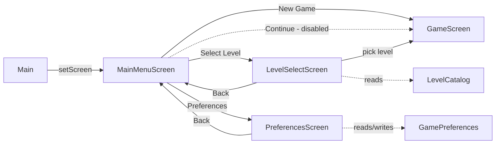

# Requirements

### Overview & Goals
Add a proper main-menu flow in front of the existing `GameScreen`, so the app opens on a menu instead of dropping straight into gameplay. The menu offers: **New Game**, **Continue** (disabled for now — no save system exists yet), **Select Level**, and **Preferences**.

### Scope
**In Scope**
- A `MainMenuScreen` with four buttons: New Game, Continue (disabled), Select Level, Preferences.
- A `LevelSelectScreen` listing the game's levels (from a small hardcoded `LevelDefinition` catalog) and launching `GameScreen` with the chosen level.
- A `PreferencesScreen` with placeholder settings (music volume, SFX volume, debug-mode toggle) persisted via libGDX `Preferences`, with a Back button.
- Making `GameScreen` accept a level path instead of always loading `maps/demo_room_start.tmx`, so both New Game and Select Level route through the same screen.
- Wiring `Main` (the `Game` entry point) to boot into `MainMenuScreen` instead of `GameScreen`.

**Out of Scope**
- Any actual save/continue persistence (player stats, current level, coins) — `Continue` is visibly present but disabled, per your decision.
- Wiring volume sliders to real audio playback — no sound system exists in the project; sliders only store values via `Preferences` for future use.
- Level locking/progression gating — all catalog levels are always selectable.

### User Stories
- As a player, I want to see a main menu on launch so I can choose what to do before jumping into gameplay.
- As a player, I want to pick a specific level from a list so I can replay any level directly.
- As a player, I want a Preferences screen so I can (eventually) adjust volume and debug settings.
- As a player, I want a disabled Continue button so I understand the feature exists but no save is available yet.

### Functional Requirements
- Launching the app shows `MainMenuScreen` with a title and four vertically stacked buttons.
- **New Game** starts `GameScreen` on the first level in the catalog.
- **Continue** is rendered but not interactive (greyed out, `Touchable.disabled`).
- **Select Level** opens `LevelSelectScreen`, listing every `LevelDefinition` (id + display name) as a button; clicking one starts `GameScreen` with that level's `.tmx` path. A Back button returns to the main menu.
- **Preferences** opens `PreferencesScreen` with a music volume slider, SFX volume slider, and a debug-mode checkbox, all initialized from and saved to `Preferences` on change. A Back button returns to the main menu.
- All new screens use the existing fixed virtual resolution (`GameConstants.VIRTUAL_WIDTH/HEIGHT`) via `FitViewport`, matching `GameScreen`'s HUD/touch-control viewports.

# Technical Design

### Current Implementation
- `Main extends Game` and unconditionally calls `setScreen(new GameScreen())` in `create()` — no menu, no screen graph.
- `GameScreen.show()` hardcodes `new MapLoader("maps/demo_room_start.tmx")` — there's no way to choose a level from outside.
- `SkinFactory.createBasicSkin()` builds a minimal programmer-art `Skin` (font, flat-color button drawables, label style) shared today by `HudStage` and `TouchControlsStage` — the same skin/pattern is the natural fit for menu screens.
- No `Preferences`, save, or settings code exists anywhere in the project (confirmed via search) — this is greenfield.
- Existing `.tmx` assets available under `assets/maps/`: `demo_room_start.tmx`, `demo_room.tmx`, `demo_room_final.tmx`, `sample_room.tmx`.

### Key Decisions
- **Navigation**: plain `Game.setScreen(new X(this))` per screen (confirmed with you) — no shared `MenuScreen` base class, matching the project's existing simple single-Game/single-Screen style (`Main`, `GameScreen`).
- **Level catalog**: a small static `LevelDefinition` list (id, display name, `.tmx` path) — recommended default since no level metadata exists today; simplest way to give `Select Level` real content without inventing a progression/locking system.
- **Continue**: kept visible but disabled (`Touchable.disabled` + dimmed color) — per your decision, no save system is introduced in this task.
- **Preferences persistence**: a small `GamePreferences` wrapper around `com.badlogic.gdx.Preferences` (`Gdx.app.getPreferences("axehigh-platformer-settings")`) storing `musicVolume`, `sfxVolume`, `debugMode` as plain floats/boolean — values are stored for future use only; no audio system is wired up (explicitly out of scope).

### Proposed Changes
- **`GameScreen`**: add a constructor parameter `String levelPath` (used instead of the hardcoded `"maps/demo_room_start.tmx"` in `show()`); keep a no-arg constructor that defaults to `LevelCatalog.levels().first().tmxPath` so nothing else breaks.
- **`Main`**: `create()` calls `setScreen(new MainMenuScreen(this))` instead of `new GameScreen()`.
- **New `LevelCatalog`** (`map` package): static `Array<LevelDefinition>` of the four existing maps, exposed via a static getter; `LevelDefinition` is a tiny immutable POJO `{id, displayName, tmxPath}`.
- **New `GamePreferences`** (`util` package, alongside `Timer`): thin wrapper exposing `getMusicVolume()/setMusicVolume()`, `getSfxVolume()/setSfxVolume()`, `isDebugMode()/setDebugMode()`, backed by `Preferences`, calling `.flush()` on every setter.
- **New menu screens** (`screens` package), each independently implementing `Screen` (per the confirmed no-shared-base decision), each owning its own `Stage` + reused `SkinFactory.createBasicSkin()` instance:
  - `MainMenuScreen`: title label + 4 `TextButton`s in a `Table` (`setFillParent(true)`); button `ChangeListener`s call `game.setScreen(...)`.
  - `LevelSelectScreen`: title + a `TextButton` per `LevelDefinition` from `LevelCatalog`, laid out in a `Table`, plus a Back button.
  - `PreferencesScreen`: two `Slider`s (music/SFX, 0–100) + one `CheckBox` (debug mode), pre-filled from `GamePreferences`, each with a `ChangeListener` that writes straight back to `GamePreferences`; plus a Back button.
- Each menu screen follows the `HudStage`/`TouchControlsStage` lifecycle conventions already used in `GameScreen`: `Gdx.input.setInputProcessor(stage)` in `show()`, `stage.act/draw` in `render()`, `stage.getViewport().update(w, h, true)` in `resize()`, `stage.dispose()` + `skin.dispose()` in `dispose()`.

### Data Models / Contracts
```java
// map/LevelDefinition.java
public class LevelDefinition {
    public final String id;
    public final String displayName;
    public final String tmxPath;
}

// map/LevelCatalog.java
public final class LevelCatalog {
    public static Array<LevelDefinition> levels(); // e.g. 4 entries backed by assets/maps/*.tmx
}

// util/GamePreferences.java
public class GamePreferences {
    public float getMusicVolume(); public void setMusicVolume(float v);
    public float getSfxVolume();   public void setSfxVolume(float v);
    public boolean isDebugMode();  public void setDebugMode(boolean v);
}
```

### Components
- `MainMenuScreen` (new) — entry screen; New Game / Continue(disabled) / Select Level / Preferences buttons.
- `LevelSelectScreen` (new) — lists `LevelCatalog` entries, launches `GameScreen(levelPath)`.
- `PreferencesScreen` (new) — music/SFX sliders + debug checkbox bound to `GamePreferences`.
- `LevelCatalog` / `LevelDefinition` (new, `map` package) — static level metadata.
- `GamePreferences` (new, `util` package) — settings persistence wrapper.
- `GameScreen` (modified) — now takes a level path instead of a hardcoded one.
- `Main` (modified) — boots into `MainMenuScreen`.
- `SkinFactory` (reused, unmodified or lightly extended with a larger "title" label style if needed for menu headings).

### File Structure
```
core/src/main/java/com/axehigh/platformer/
  Main.java                         (modified)
  screens/
    GameScreen.java                 (modified: level path param)
    MainMenuScreen.java              (new)
    LevelSelectScreen.java           (new)
    PreferencesScreen.java           (new)
  map/
    LevelDefinition.java             (new)
    LevelCatalog.java                (new)
  util/
    GamePreferences.java             (new)
```

### Architecture Diagram


### Risks
- This is a menu-only feature; it does not add/change ECS `Component`s or `System`s, so per project convention no update to `ashley-ecs.md`/`enemies.md`/`gameplay.md` is required (no gameplay mechanic changes).
- `GameScreen`'s no-arg constructor must keep working (used implicitly today) to avoid breaking anything referencing it directly — handled by delegating to the parameterized constructor with the catalog's first level.

# Testing

### Validation Approach
Build the project after each stage (`./gradlew :core:compileJava` or full desktop build) and manually trace navigation logic by reading the wired `ChangeListener`s, since this is UI-only Scene2D code without existing automated UI tests in the project.

### Key Scenarios
- App launches into `MainMenuScreen` (not directly into gameplay).
- New Game button transitions to `GameScreen` loaded with the catalog's first level.
- Select Level shows all `LevelCatalog` entries and each one launches `GameScreen` with the correct `.tmx` path.
- Preferences sliders/checkbox reflect previously saved values on re-entry (persisted via `GamePreferences`/`Preferences.flush()`).
- Continue button is visibly present but does not respond to clicks/taps (`Touchable.disabled`).
- Back buttons on Level Select and Preferences correctly return to `MainMenuScreen`.

### Edge Cases
- Resizing the window/rotating on mobile keeps each menu screen's UI aligned (`viewport.update(w, h, true)` in every `resize()`).
- Disposing a menu screen (`dispose()`) properly releases its `Stage` and `Skin` without leaking, matching `GameScreen`'s disposal pattern.
- `GameScreen`'s existing no-arg usage (if any) still compiles and behaves identically after adding the level-path constructor.

# Delivery Steps

### ✓ Step 1: Add level catalog and preferences support classes
Introduce the small data/persistence classes the menu screens will depend on, with no UI yet.
- Add `LevelDefinition` (id, displayName, tmxPath) in the `map` package.
- Add `LevelCatalog` in the `map` package exposing a static list of `LevelDefinition`s backed by the existing `assets/maps/*.tmx` files (demo_room_start, demo_room, demo_room_final, sample_room).
- Add `GamePreferences` in the `util` package wrapping `com.badlogic.gdx.Preferences` with `musicVolume`, `sfxVolume`, and `debugMode` getters/setters that flush on write.
- No screens reference these yet; this stage is purely foundational data/support code.

### ✓ Step 2: Parameterize GameScreen by level and rewire Main to boot into the menu
Make `GameScreen` level-agnostic and detach `Main` from launching gameplay directly.
- Add a `GameScreen(String levelPath)` constructor and use `levelPath` instead of the hardcoded `"maps/demo_room_start.tmx"` in `show()`.
- Keep a no-arg `GameScreen()` constructor that delegates to the new one using `LevelCatalog.levels().first().tmxPath`.
- Update `Main.create()` to call `setScreen(new MainMenuScreen(this))` instead of `new GameScreen()` (the new screen is added in the next stage).

### ✓ Step 3: Build MainMenuScreen with New Game, disabled Continue, Select Level, and Preferences buttons
Implement the main menu screen and its navigation, completing the primary entry point.
- Add `MainMenuScreen` implementing `Screen`, using `SkinFactory.createBasicSkin()` and a `Stage`/`Table` layout (title + 4 stacked `TextButton`s), matching the Stage lifecycle conventions from `GameScreen`'s `HudStage`/`TouchControlsStage`.
- Wire `New Game` to `game.setScreen(new GameScreen(LevelCatalog.levels().first().tmxPath))`.
- Render `Continue` as a dimmed, `Touchable.disabled` button (non-functional, per current save-less scope).
- Wire `Select Level` and `Preferences` buttons to navigate to the screens built in the following stages (forward references compile once those classes exist).

### ✓ Step 4: Build LevelSelectScreen listing the level catalog
Implement the level-picker screen that lets the player jump directly into any catalog level.
- Add `LevelSelectScreen` implementing `Screen`, rendering a title, one `TextButton` per `LevelDefinition` from `LevelCatalog.levels()`, and a Back button, laid out via `Table`.
- Each level button's `ChangeListener` calls `game.setScreen(new GameScreen(level.tmxPath))`.
- Back button calls `game.setScreen(new MainMenuScreen(game))`.
- Follow the same Stage/Skin lifecycle (show/render/resize/dispose) as `MainMenuScreen`.

### ✓ Step 5: Build PreferencesScreen bound to GamePreferences
Implement the settings screen with placeholder, persisted options.
- Add `PreferencesScreen` implementing `Screen`, with a title, a music-volume `Slider`, an SFX-volume `Slider`, and a debug-mode `CheckBox`, all initialized from `GamePreferences` on `show()`.
- Attach `ChangeListener`s to each widget that immediately persist the new value via the corresponding `GamePreferences` setter.
- Add a Back button that calls `game.setScreen(new MainMenuScreen(game))`.
- Follow the same Stage/Skin lifecycle as the other menu screens.