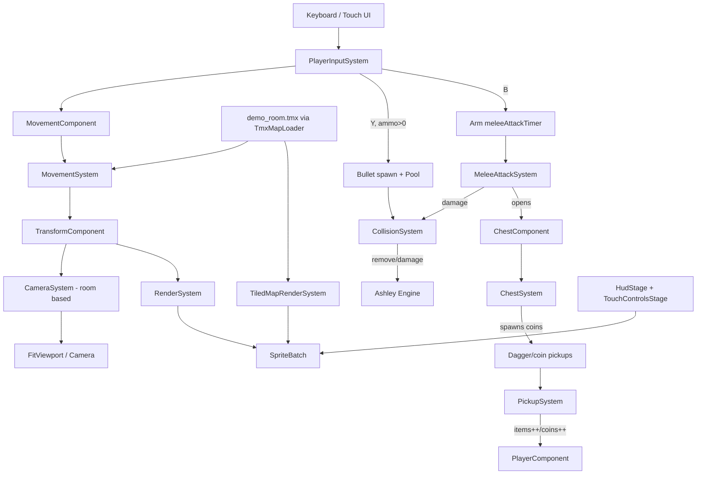

# Requirements

### Overview & Goals
Build a retro 2D side-scrolling, Tiled-map-based, medieval-dungeon platformer on top of the existing empty libGDX multi-platform project (`android`, `ios`, `html`, `lwjgl3`, `core`), following the architecture mandated by `AGENTS.md` and the advanced traversal/combat mechanics mandated by `../../../resources/docs-ai/gameplay.md`. The two reference screenshots (`../../resources/inspiration/img.png`, `../../resources/inspiration/img_1.png`) define the target visual/HUD language: dark-blue brick dungeon rooms, stone-wall foreground platforms, torches, jail windows, chests, a knight statue, a player character with sword, and a mobile HUD/touch-control overlay.

### Scope
**In Scope**
- Ashley ECS engine bootstrap (components + systems) per `AGENTS.md` sections 1-2.
- Tiled (`.tmx`) map loading, static collision-layer parsing, and object-layer entity spawning per `AGENTS.md` section 3.
- A small hand-authored demo `.tmx` dungeon room reproducing the reference screenshots' layer structure (brick background, collision floors/platforms, torches/chests/gate object markers) so the pipeline is exercised end-to-end, using placeholder/programmer-art textures (no final art pack exists yet).
- Room-based flip-screen `CameraSystem` exactly as specified in `AGENTS.md` section E (no smooth follow).
- HUD (hearts, coin counter, item tracker, pause button) and on-screen touch controls (D-pad, A/B/Y) via Scene2D.ui, matching the reference screenshots' layout, wired alongside keyboard input.
- Advanced traversal mechanics from `../../../resources/docs-ai/gameplay.md`: double jump, wall climbing.
- Shooting/combat mechanics from `../../../resources/docs-ai/gameplay.md`: `BulletComponent`, projectile spawning, projectile collision handling, bullet pooling.
- Close-combat strike attack (**B**) as an instantaneous melee hitbox check against enemies, independent of the ranged shoot attack, with its own cooldown and no ammo cost.
- Ammo-gated ranged shoot attack (**Y**): the existing HUD item tracker (`sword` icon, `x 00/30`) is repurposed to track dagger/throwing-weapon ammo; shooting is a no-op once ammo reaches 0.
- Dagger pickup entities on the Tiled object layer that replenish shoot ammo up to the existing max (30), following the existing object-layer spawn pattern.
- Coin pickups: the existing `coin` object-layer markers become collectible entities that increment `PlayerComponent.coins` (already displayed by `HudStage`) and are removed on player overlap.
- Chest interaction: melee-striking an unopened chest opens it, has it disappear shortly after, and drops a random number of coin pickups the player can then walk over to collect.
- Close-combat visual feedback: the player's sprite visibly changes while a melee strike is active, so it's clear on-screen that the close-combat attack (not the shoot attack) is happening.
- Facing-direction sprite flip: the player's sprite mirrors horizontally to face left/right, matching `PlayerComponent.facingDirection`.
- Keyboard **B** and **Y** keys wired to trigger the same melee/shoot handlers as the on-screen **B**/**Y** touch buttons, in addition to the existing `J`/`K` keybindings.

**Out of Scope**
- Final production pixel-art assets and tilesets (only placeholder/programmer art is created; real art is a follow-up once supplied).
- Enemy AI behavior systems beyond what's needed to receive bullet/melee damage (no patrol/pathing logic).
- Level design beyond one demo room used to validate systems.
- Torch decorations remain purely decorative (no collection/interaction logic); only daggers and coins are collectible.
- Save/load, menus, and audio.

### User Stories
- As a player, I can move, jump twice in a row, and cling to walls to traverse dungeon rooms built from Tiled maps.
- As a player, I can shoot projectiles that destroy on wall impact or damage enemies.
- As a player, I see my health (hearts), coin count, and item progress in a HUD matching the reference screenshots, and can control the character via keyboard or on-screen touch buttons.
- As a player, the camera snaps room-to-room (flip-screen) instead of scrolling smoothly, matching classic dungeon-crawler platformers.
- As a player, I can press B to strike enemies in melee range at any time (no ammo required), separate from Y which throws a limited supply of daggers I must collect.
- As a player, I can walk over coins to collect them and see my coin counter increase.
- As a player, I can melee-strike a chest to break it open for a random amount of coins.
- As a player, I can visually tell when I'm mid-attack and which way I'm facing, and I can use the keyboard's actual B/Y keys as an alternative to clicking the touch buttons.

### Functional Requirements
- Player entity spawns at the Tiled map's start-gate object marker and can move left/right, jump (single + double), wall-climb, and shoot, with all physics resolved via AABB grid collision against the collision layer.
- HUD top-left shows avatar + heart icons reflecting current health; top-center shows a coin counter (`x 0000` style); top-right shows an item tracker (`x 02/30` style) and a pause button, per the screenshots.
- Touch overlay renders a bottom-left D-pad and bottom-right A/B/Y buttons that drive the same `MovementComponent`/action logic as keyboard input.
- Camera recalculates the active room index from player position each frame and centers on that room only when the room index changes (no per-frame smooth tracking).
- Bullets despawn on wall impact, on enemy impact (after applying damage), or after their lifetime expires; bullet entities are pooled to avoid GC spikes.
- Pressing B triggers a short melee strike: while its active window is open, any overlapping enemy takes melee damage exactly once per press, gated by its own cooldown independent of the shoot cooldown.
- Pressing Y only fires a dagger if `PlayerComponent.items > 0`; each shot decrements `items` by 1, and firing is a no-op when ammo is 0.
- Touching a dagger pickup object increments `items` (capped at `maxItems`) and removes the pickup entity; the HUD item-tracker icon changes to a dagger icon to reflect the new ammo semantics.
- Touching a coin pickup object increments `PlayerComponent.coins` by the coin's value and removes the pickup entity; the HUD's existing coin counter reflects the new total immediately.
- Melee-striking an unopened chest marks it opened (no further hits affect it), after a brief delay removes the chest entity, and spawns a random number (e.g. 2-6) of coin pickup entities scattered near its position.
- While `meleeAttackTimer > 0`, the player's rendered sprite shows a distinct attacking frame/tint so the close-combat strike is visually obvious, independent of the shoot attack.
- The player's sprite is mirrored horizontally whenever `facingDirection` is -1 (left) and un-mirrored when 1 (right), updating every frame the direction changes.
- Pressing the keyboard **B** key triggers the exact same melee handler as `requestTouchMelee()`/keyboard `J`; pressing keyboard **Y** triggers the exact same shoot handler as `requestTouchShoot()`/keyboard `K`.

# Technical Design

### Current Implementation
The project is a freshly generated libGDX multi-module template (`core`, `android`, `ios`, `html`, `lwjgl3`). `core/build.gradle` already declares `ashley`, `gdx`, `gdx-ai`, `gdx-freetype` dependencies, so no new Gradle dependencies are required for ECS. `Main.java` just calls `setScreen(new FirstScreen())`, and `FirstScreen.java` is an empty `Screen` stub with no rendering, camera, or viewport code. There are no components/systems, no `.tmx` files, and no sprite assets in `assets/` (only `.gitkeep`) — only two reference screenshots under `../../resources/inspiration/`. This is effectively a from-scratch ECS build governed entirely by `AGENTS.md` and `../../../resources/docs-ai/gameplay.md`.

Since the initial build (Steps 1-6, complete): both `B` and `Y` call the same shared `requestTouchAttack()`/keyboard handlers to spawn an unlimited-ammo bullet in `PlayerInputSystem`. `PlayerComponent.items`/`maxItems` already exist and are rendered by `HudStage` as a `sword` icon + `x 00/30` counter, but nothing currently increments `items` or gates shooting on it — `EntityFactory.spawnObjects` spawns coins/chests/torches as purely decorative entities with no player-overlap/pickup detection anywhere in the project. `AnimationComponent.State.ATTACKING` already exists in the enum but `AnimationSystem.resolvePlayerState` never produces it.

After Steps 7-10 (complete): `PlayerInputSystem` now splits melee (**B**/`J`) from shoot (**Y**/`K`), `MeleeAttackSystem` resolves an instantaneous strike hitbox against `EnemyComponent` entities, `PickupSystem` handles `DaggerPickupComponent` overlap (incrementing `items`), and `AnimationSystem.resolvePlayerState` already returns `ATTACKING` while `meleeAttackTimer > 0` — but no animation frame is registered for `ATTACKING` (only `IDLE` is registered in `GameScreen.attachIdleAnimation`), so the state change currently has no visible effect. `PlayerComponent.coins` exists and is already rendered by `HudStage`'s coin counter, but nothing increments it. `EntityFactory.spawnObjects`'s `"coin"` and `"chest"` cases still call the plain `createDecoration()` helper (no `CollisionComponent`, no pickup/interaction component), so coins can't be collected and chests can't be struck. `RenderSystem`/`TransformComponent` support a `scale` vector but nothing currently sets `scale.x` based on `facingDirection`, so the player sprite never visually flips despite `facingDirection` already being tracked correctly. Only keyboard `J`/`K` (plus touch) currently trigger melee/shoot — the literal `B`/`Y` keys are unbound.

### Key Decisions
Since these were not confirmed with the user, the plan proceeds with the following defaults (called out explicitly so they can be revisited):
- **Build order — foundation first:** ECS/rendering/Tiled/camera scaffolding is built before layering gameplay.md's double jump/wall-climb/shooting on top, since those mechanics depend on a working `MovementSystem` and collision grid.
- **Assets — placeholder art + one hand-authored demo `.tmx`:** Since no real tileset/sprite atlas exists, simple placeholder textures are used and a single small demo room `.tmx` is authored (background/collision/object layers) to exercise the full pipeline, matching the room composition seen in the reference screenshots.
- **Input — keyboard and touch implemented together:** `PlayerInputSystem` reads from both a keyboard handler and the Scene2D.ui touch D-pad/A-B-Y buttons via an `InputMultiplexer`, both writing into the same `MovementComponent`/action flags, since the project targets android/ios/html/lwjgl3 simultaneously.
- **Reuse `items`/`maxItems` as dagger ammo:** Rather than introducing a new field, `PlayerComponent.items` becomes the dagger/shoot-ammo count and `maxItems` its cap, minimizing churn to `HudStage`'s existing `x NN/NN` counter; only its icon (`gfx/sword.png` → new `gfx/dagger.png`) changes to match the new meaning.
- **Melee resolved as an instantaneous hitbox, not a projectile:** A new `MeleeAttackSystem` mirrors `CollisionSystem`'s bullet-vs-enemy pattern (look up the enemy family once in `addedToEngine`, then AABB-check) but operates on a short-lived rectangle in front of the player instead of a moving `BulletComponent` entity, since a strike has no travel time.
- **Pickups scoped to daggers only:** A minimal `DaggerPickupComponent` + `PickupSystem` pair is added purely for ammo pickups; coin/chest/torch decorations are intentionally left as-is (still non-collectible) to keep this change focused on the requested combat feature.
- **Generalize `PickupSystem` rather than duplicating it for coins:** `PickupSystem`'s family becomes `Family.one(DaggerPickupComponent.class, CoinPickupComponent.class)` and branches on which component is present, reusing the existing single-player-lookup/AABB-overlap logic instead of adding a near-duplicate `CoinPickupSystem`.
- **Chest "hit" detection lives in `MeleeAttackSystem`; the post-open delay lives in a new `ChestSystem`:** `MeleeAttackSystem` reuses its existing strike-rectangle-vs-family-overlap pattern to detect an unopened chest in the same pass as enemies (marking it `opened` and swapping its texture), but the countdown-then-remove-and-drop-coins behavior is owned by a small new `ChestSystem` so `MeleeAttackSystem` doesn't need to track per-entity timers for non-instantaneous effects.
- **Facing flip via `transform.scale.x` sign, not `TextureRegion.flip()`:** Since `AnimationComponent` keyframes are shared `TextureRegion` instances reused across draws/entities, mutating a region's UVs in place would be error-prone to track correctly; instead `AnimationSystem` sets the player's `transform.scale.x` sign to match `facingDirection`, and `RenderSystem` already multiplies region width by `transform.scale.x`, so a negative scale mirrors the draw for free.
- **Attack feedback reuses the existing (already-wired) `ATTACKING` animation state:** Rather than adding a new VFX/particle system, a placeholder `gfx/player_attack.png` frame is registered for `AnimationComponent.State.ATTACKING` in `GameScreen`, so the already-correct `AnimationSystem.resolvePlayerState` priority logic (melee takes priority over movement states) becomes visible for the first time.
- **Keyboard `B`/`Y` are added, not swapped in for `J`/`K`:** Both keybindings remain active so existing behavior/tests aren't disrupted; this mirrors how touch and keyboard already coexist for movement (`A`/`D` and arrow keys).

### Proposed Changes
- Replace `FirstScreen` usage with a `GameScreen` that owns the Ashley `Engine`, an `OrthographicCamera` + `FitViewport` at a fixed virtual resolution (480x270), `TextureFilter.Nearest`, an `AssetManager`, and adds/updates all systems each frame using `Gdx.graphics.getDeltaTime()`.
- Implement core components exactly as named in `AGENTS.md` §2: `TransformComponent`, `TextureComponent`, `AnimationComponent`, `MovementComponent`, `CollisionComponent`, `PlayerComponent` (extended per `../../../resources/docs-ai/gameplay.md` §1A with `jumpCount`, `maxJumps=2`, `isWallClimbing`, `facingDirection`, `shootCooldownTimer`), plus new `BulletComponent` (`damage`, `lifetime`).
- Implement core systems: `PlayerInputSystem`, `MovementSystem` (AABB grid collision + gravity + double jump + wall climb), `AnimationSystem`, `RenderSystem` (z-sorted `SpriteBatch` draw), `TiledMapRenderSystem`/render integration, `CameraSystem` (flip-screen room logic per `AGENTS.md` §E), `CollisionSystem` (bullet-wall/bullet-enemy resolution).
- Build a `MapLoader`/`EntityFactory` that parses the collision tile layer into a static AABB boundary set at load time, and parses object layers to spawn player-start, coin, chest, torch, and exit-gate entities.
- Build a Scene2D.ui `HudStage` (hearts/avatar, coin counter, item tracker, pause button) and `TouchControlsStage` (D-pad, A/B/Y buttons) rendered on top of the game viewport, both reflecting the layouts in `img.png`/`img_1.png`.
- Implement bullet spawning (on B/Y press, respecting `shootCooldownTimer`) using a libGDX `Pool<Entity>` (or equivalent Ashley pooling) per `../../../resources/docs-ai/gameplay.md` §3B to avoid GC stutter.
- Extend `PlayerComponent` with `meleeCooldownTimer`, `meleeAttackTimer`, and `meleeHasHit`, and split the shared attack trigger in `PlayerInputSystem` into a melee trigger (**B**/keyboard `J`) and a shoot trigger (**Y**/keyboard `K`), each gated by its own cooldown.
- Gate `spawnBullet()` on `player.items > 0`, decrementing `items` by 1 per shot; on melee trigger (cooldown ready), arm `meleeAttackTimer`/reset `meleeHasHit` instead of spawning any entity.
- Add `MeleeAttackSystem`: while `meleeAttackTimer > 0` and `!meleeHasHit` for the player entity, build a strike rectangle offset from the player's `CollisionComponent` bounds in `facingDirection`, damage any overlapping enemy once, then mark `meleeHasHit = true` and count down `meleeAttackTimer`.
- Add `DaggerPickupComponent` (marker + `amount`) and `PickupSystem`: for each pickup entity, check overlap against the single player entity (looked up in `addedToEngine`, mirroring `CollisionSystem`'s enemy lookup); on overlap, increment `player.items` (capped at `maxItems`) and remove the pickup.
- Extend `EntityFactory.spawnObjects` with a `"dagger"` case that spawns a `Transform`+`Texture`+`Collision`+`DaggerPickupComponent` entity, and add 2 `dagger` object markers to `assets/maps/demo_room.tmx`'s object layer.
- Update `AnimationSystem.resolvePlayerState` to return the existing (currently unused) `AnimationComponent.State.ATTACKING` while `meleeAttackTimer > 0`, taking priority over movement-derived states.
- Update `TouchControlsStage` so the **B** button calls a new `requestTouchMelee()` and the **Y** button calls a new `requestTouchShoot()` (replacing the shared `requestTouchAttack()`), and update `HudStage`'s item-tracker icon from `gfx/sword.png` to a new `gfx/dagger.png`.
- Per `AGENTS.md`'s Gameplay Documentation Sync rule, update `resources/docs-ai/gameplay.md` with the close-combat strike, ammo-gated shoot, and dagger pickup mechanics.
- Add `CoinPickupComponent` (`amount`, default 1) and extend `EntityFactory`'s `"coin"` case to build a `Transform`+`Texture`+`Collision`+`CoinPickupComponent` entity (instead of the plain decoration), reusing `gfx/coin.png`.
- Generalize `PickupSystem`'s family to `Family.one(DaggerPickupComponent.class, CoinPickupComponent.class)`; in `processEntity`, branch on which marker is present to increment either `player.items` (capped at `maxItems`) or `player.coins` (uncapped), then remove the pickup.
- Add `ChestComponent` (`opened`, `disappearTimer`) and extend `EntityFactory`'s `"chest"` case to build a `Transform`+`Texture`+`Collision`+`ChestComponent` entity (instead of the plain decoration).
- Extend `MeleeAttackSystem` to also look up a `ChestComponent` family in `addedToEngine`; within the same `!player.meleeHasHit` strike-resolution block, if the strike rectangle overlaps an unopened chest, set `chest.opened = true`, swap its `TextureComponent.region` to a new placeholder `gfx/chest_open.png`, and start `chest.disappearTimer` (e.g. ~0.3s).
- Add `ChestSystem` (new `IteratingSystem` over `ChestComponent` entities): while `chest.opened` and `disappearTimer > 0`, count it down; at 0, remove the chest entity and spawn `MathUtils.random(2, 6)` coin pickup entities (via a new `EntityFactory.createCoinPickup(x, y)` helper) at small random offsets from the chest's last position.
- Update `GameScreen.attachIdleAnimation` (renamed to reflect its expanded role) to also register a one-frame `Animation` for `AnimationComponent.State.ATTACKING` using a new placeholder `gfx/player_attack.png` texture, and load/register `ChestSystem` plus the two new textures (`gfx/player_attack.png`, `gfx/chest_open.png`).
- Update `AnimationSystem.processEntity` to set the player entity's `transform.scale.x` to `Math.abs(transform.scale.x) * player.facingDirection` each frame, mirroring the sprite via `RenderSystem`'s existing scale-aware width calculation.
- Extend `PlayerInputSystem.processEntity`'s existing `meleePressed`/`shootPressed` checks to also treat `Input.Keys.B` as a melee trigger and `Input.Keys.Y` as a shoot trigger, alongside the existing `J`/`K` checks.

### Data Models / Contracts
```java
class PlayerComponent implements Component {
  int health; int coins;
  int items; int maxItems = 30; // repurposed: dagger/shoot ammo count + cap
  int jumpCount; int maxJumps = 2;
  boolean isWallClimbing;
  int facingDirection; // -1 left, 1 right
  float shootCooldownTimer;
  float meleeCooldownTimer;
  float meleeAttackTimer; // >0 while the strike hitbox is active
  boolean meleeHasHit; // ensures a single swing damages an enemy at most once
}

class BulletComponent implements Component {
  float damage;
  float lifetime; // despawn after ~1.5s
}

class CollisionComponent implements Component {
  Rectangle bounds;
}

class DaggerPickupComponent implements Component {
  int amount = 5; // ammo granted to PlayerComponent.items on pickup
}

class CoinPickupComponent implements Component {
  int amount = 1; // coins granted to PlayerComponent.coins on pickup
}

class ChestComponent implements Component {
  boolean opened = false;
  float disappearTimer = 0f; // counts down after opening; on reaching 0, chest is removed and drops coins
}
```

### Components
- **`GameScreen`** (new, replaces `FirstScreen` usage in `Main`): owns `Engine`, viewport/camera, `AssetManager`, drives system updates.
- **`PlayerInputSystem`** (updated): keyboard + touch input to velocity/action flags, including double-jump trigger, plus separate melee (**B**) and shoot (**Y**) triggers with independent cooldowns and ammo gating.
- **`MovementSystem`** (new): position integration, AABB grid collision resolution, grounded jump-count reset, wall-climb latch/release.
- **`AnimationSystem`** (updated): frame selection per state (idle/run/jump/double-jump/wall-climb/attack), now also produces `ATTACKING` during a melee strike.
- **`RenderSystem`** (new): z-sorted entity drawing via `SpriteBatch`.
- **`TiledMapRenderSystem`** (new): `OrthogonalTiledMapRenderer` integration, layered correctly with entity rendering.
- **`CameraSystem`** (new): flip-screen room camera per `AGENTS.md` §E formulas, optional lerp transition with input freeze.
- **`CollisionSystem`** (new): bullet-vs-wall and bullet-vs-enemy resolution, entity removal.
- **`MeleeAttackSystem`** (updated): resolves the close-combat strike hitbox against enemies once per swing, now also detects/opens an overlapping unopened chest in the same pass.
- **`PickupSystem`** (updated): generalized to resolve both dagger-pickup-vs-player and coin-pickup-vs-player overlap, incrementing ammo or coins and removing the pickup entity.
- **`ChestSystem`** (new): owns the opened-chest disappear-timer countdown and spawns a random number of coin pickups when a chest is removed.
- **`AnimationSystem`** (updated again): now also flips the player's `transform.scale.x` to match `facingDirection`, and (via a newly-registered `ATTACKING` frame in `GameScreen`) the existing `ATTACKING` state becomes visibly distinct.
- **`PlayerInputSystem`** (updated again): keyboard `B`/`Y` now trigger the same melee/shoot handlers as `J`/`K` and the touch buttons.
- **`HudStage` / `TouchControlsStage`** (updated, Scene2D.ui): visual overlay matching the two reference screenshots; touch buttons now map to three distinct actions (melee/jump/shoot), the item tracker shows dagger ammo, and the coin counter now reflects real collected coins.

### File Structure
```
core/src/main/java/com/axehigh/platformer/
  Main.java (updated to launch GameScreen)
  screens/GameScreen.java (new)
  ecs/components/{Transform,Texture,Animation,Movement,Collision,Player,Bullet}Component.java (new)
  ecs/components/DaggerPickupComponent.java, CoinPickupComponent.java, ChestComponent.java (new)
  ecs/systems/{PlayerInput,Movement,Animation,Render,TiledMapRender,Camera,Collision}System.java (new)
  ecs/systems/{MeleeAttack,Pickup,Chest}System.java (new)
  map/MapLoader.java, map/EntityFactory.java (new/updated for "dagger"/"coin"/"chest" objects)
  ui/HudStage.java, ui/TouchControlsStage.java (new/updated for 3-button mapping)
assets/
  maps/demo_room.tmx (updated with dagger object markers)
  gfx/*.png (new placeholder textures, incl. dagger.png, player_attack.png, chest_open.png)
```

### Architecture Diagram


### Risks
- Without final art assets, placeholder textures/demo map will need to be swapped later; keep texture regions and map layer names decoupled from hardcoded asset paths where practical.
- Wall-climb and double-jump interact with the same grounded/jump-count state; care is needed in `MovementSystem` ordering to avoid conflicting resets in the same frame.
- Room-based camera transitions (freeze + lerp) must not desync from Tiled map room boundaries if map dimensions aren't exact multiples of the virtual resolution.
- Ammo depletion exactly as **Y** is pressed must silently drop the shot (no partial bullet, no cooldown applied), matching the existing cooldown-drop-on-request pattern.
- Melee and shoot triggered on the same frame must not cross-talk: each keeps its own cooldown/timer pair now that the previously shared attack handler is split in two.
- A chest struck multiple times before its `disappearTimer` elapses must not double-spawn coins or re-trigger the open swap; guarded by the `opened` flag so only the first strike has any effect.
- Sharing `TextureRegion` keyframes across the flip logic could desync visually if `.flip()` were used instead of `transform.scale.x`; the scale-based approach avoids this but relies on `RenderSystem` continuing to multiply region width by `transform.scale.x`.
- Randomized coin-drop counts and coin-scatter offsets are arbitrary placeholder tuning values, easy to rebalance later without further architectural changes.

# Testing

### Validation Approach
Since no automated test harness exists yet, validation relies on building the project (`./gradlew :core:compileJava`, `:lwjgl3:run` where possible) and manual/log-driven checks against the demo map and reference screenshots.

### Key Scenarios
- Engine boots into `GameScreen`, loads `demo_room.tmx`, and renders background/collision/object layers with the player spawned at the start-gate marker.
- Player can walk, jump, double-jump (verify `jumpCount` resets to 0 on landing), wall-climb against a marked wall tile, and shoot a bullet that despawns on wall or enemy impact.
- HUD reflects health/coin/item values from `PlayerComponent`, and touch D-pad/A/B/Y buttons produce the same effect as keyboard equivalents.
- Camera jumps discretely between rooms only when `roomX`/`roomY` changes, never scrolling smoothly.
- Pressing **B** repeatedly damages an overlapping enemy once per swing (respecting `meleeCooldownTimer`), regardless of current `items` ammo count.
- Pressing **Y** with `items == 0` spawns no bullet and does not enter cooldown; picking up a dagger object increases `items` (capped at `maxItems`) and is reflected immediately in the HUD's dagger icon/counter.
- Walking over a coin object increases `PlayerComponent.coins` and removes the coin entity, visible immediately in the HUD's coin counter.
- Melee-striking an unopened chest opens it, the chest disappears shortly after, and the resulting coin pickups can themselves be collected to further increase `coins`.
- The player's sprite visibly changes while `meleeAttackTimer > 0` and mirrors horizontally when moving/facing left vs. right.
- Keyboard **B** produces the same effect as touch **B** (melee); keyboard **Y** produces the same effect as touch **Y** (shoot).

### Edge Cases
- Player jumping at a room boundary while a bullet is in flight (verify bullet position isn't affected by camera room switch).
- Rapid-fire shooting requests while `shootCooldownTimer > 0` are ignored, not queued.
- Wall-climb release when the player reaches the bottom of a wall tile or presses away from the wall mid-climb.
- Dagger pickup overlapping the player exactly at `maxItems` capacity does not overflow `items` past `maxItems`.
- Melee strike executed while airborne/wall-climbing still applies damage but must not interfere with `jumpCount`/`isWallClimbing` state transitions in `MovementSystem`.
- Striking a chest that's already `opened` (mid-disappear) has no additional effect (no repeated coin drops).
- Rapidly toggling `facingDirection` (e.g. tapping left/right quickly) flips the sprite every frame without leaving it in a torn/partially-flipped state.
- Coin pickups spawned by a broken chest that land outside the collision-free floor area (e.g. against a wall) are still collectible since they only require AABB overlap, not grounded contact.

# Delivery Steps

### ✓ Step 1: Bootstrap Ashley ECS engine, viewport, and rendering pipeline
GameScreen replaces FirstScreen and drives a working Ashley Engine with a fixed-resolution viewport.
- Implement `TransformComponent`, `TextureComponent`, `AnimationComponent`, `MovementComponent`, `CollisionComponent`, `PlayerComponent` (base fields only).
- Implement `RenderSystem` (z-sorted SpriteBatch draw) and `AnimationSystem` (state-driven frame selection).
- Create `GameScreen` with `FitViewport` at 480x270, `TextureFilter.Nearest`, `AssetManager`, and delta-time-driven engine update loop.
- Update `Main.java` to launch `GameScreen` instead of `FirstScreen`.
- Add placeholder textures under `assets/gfx/` for the player and a simple tile.

### ✓ Step 2: Integrate Tiled maps and static collision loading
A demo dungeon room loads from a .tmx file with background, collision, and object layers.
- Author `assets/maps/demo_room.tmx` reproducing the reference screenshots' layer structure (brick background, stone floor/platform collision tiles, object markers for start gate, exit gate, torches, chest, coins).
- Implement `TiledMapRenderSystem` using `TmxMapLoader`/`OrthogonalTiledMapRenderer`, integrated so background draws behind entities and foreground (if any) draws above.
- Implement `MapLoader`/`EntityFactory` that reads the collision layer into a static AABB boundary set at load time and parses object layers to spawn player-start, coin, chest, torch, and exit-gate entities.

### ✓ Step 3: Implement player movement, grid collision, and room-based camera
The player character moves, jumps once, and collides correctly with the demo map, with a discrete flip-screen camera.
- Implement `PlayerInputSystem` reading keyboard input into `MovementComponent`/facing direction.
- Implement `MovementSystem` with AABB grid collision resolution against the static boundary set, gravity, and single jump with grounded reset.
- Implement `CameraSystem` per `AGENTS.md` §E: compute `roomX`/`roomY` from player position and snap camera center to the room, with no smooth per-frame tracking (optional freeze+lerp transition on room change).

### ✓ Step 4: Build HUD and on-screen touch controls
The reference screenshots' HUD and mobile control overlay render and drive the same input path as the keyboard.
- Implement `HudStage` (Scene2D.ui): top-left avatar + heart icons bound to `PlayerComponent.health`, top-center coin counter bound to `coins`, top-right item tracker + pause button bound to `items`.
- Implement `TouchControlsStage`: bottom-left D-pad, bottom-right A/B/Y buttons, wired via `InputMultiplexer` into the same `PlayerInputSystem` handlers used by keyboard.
- Layer both stages above the `FitViewport` game render without disturbing the virtual-resolution scaling.

### ✓ Step 5: Add double jump and wall climbing mechanics
Player can double jump and cling/wall-jump per gameplay.md, with correct state resets.
- Extend `PlayerComponent` with `jumpCount`, `maxJumps=2`, `isWallClimbing`, `facingDirection`, `shootCooldownTimer`.
- Extend `PlayerInputSystem`/`MovementSystem` to allow a second jump while airborne, incrementing `jumpCount`, and reset it to 0 on grounded contact.
- Implement wall-detection AABB probe in `MovementSystem`: latch (`isWallClimbing=true`, reduced fall speed, `jumpCount=1`) when moving into a wall while airborne and holding toward it; release on opposite input or falling past the wall tile.
- Update `AnimationSystem` to trigger distinct jump/double-jump/wall-climb animation states.

### ✓ Step 6: Implement shooting and pooled bullet collision system
Player can fire projectiles that despawn correctly and avoid GC churn under heavy fire.
- Implement `BulletComponent` (`damage`, `lifetime`) and bullet entity spawning in `PlayerInputSystem` on B/Y press, gated by `shootCooldownTimer`, offset/velocity based on `facingDirection`.
- Implement `CollisionSystem` handling bullet-vs-collision-layer impact (remove bullet) and bullet-vs-enemy-entity impact (apply damage, remove bullet), plus lifetime-based despawn.
- Add a `Pool`-based (or Ashley pooled component) bullet reuse mechanism to avoid per-shot allocation during heavy combat sequences.

### ✓ Step 7: Split B/Y input handling and implement the close-combat strike attack
Pressing **B** performs an instant melee strike with its own cooldown, independent of the shoot action.
- Extend `PlayerComponent` with `meleeCooldownTimer`, `meleeAttackTimer`, and `meleeHasHit`.
- Replace `PlayerInputSystem`'s shared `requestTouchAttack()`/attack keybinding with two distinct handlers: a melee trigger (keyboard `J`, touch **B**) and a shoot trigger (keyboard `K`, touch **Y**), each decrementing its own cooldown timer independently.
- On melee trigger (when `meleeCooldownTimer <= 0`), arm `meleeAttackTimer` and reset `meleeHasHit`, without spawning a bullet entity.
- Implement `MeleeAttackSystem`: while `meleeAttackTimer > 0` and `!meleeHasHit` for the player, build a short strike rectangle offset from the player's collision bounds in `facingDirection`, apply melee damage to any overlapping `EnemyComponent` entity exactly once, then mark `meleeHasHit = true` and count down the timer.
- Update `AnimationSystem.resolvePlayerState` to return `AnimationComponent.State.ATTACKING` while `meleeAttackTimer > 0`, taking priority over movement-derived states.
- Register `MeleeAttackSystem` in `GameScreen`'s engine setup.

### ✓ Step 8: Gate the shoot attack on dagger ammo
Pressing **Y** only throws a dagger while `PlayerComponent.items > 0`, consuming one unit per shot.
- Update `PlayerInputSystem.spawnBullet()`'s call site to require `player.items > 0` in addition to the existing `shootCooldownTimer` gate, decrementing `items` by 1 on every successful shot.
- Ensure a shoot request made with zero ammo is silently dropped (no bullet spawned, `shootCooldownTimer` left untouched), mirroring the existing cooldown-drop behavior.

### ✓ Step 9: Implement dagger pickups that replenish shoot ammo
Walking over a dagger object on the map increases the player's ammo count, up to the existing cap.
- Add `DaggerPickupComponent` (`amount`, default 5) as a marker component for pickup entities.
- Implement `PickupSystem`: looks up the single player entity in `addedToEngine` (mirroring `CollisionSystem`'s enemy lookup), then for each `DaggerPickupComponent` entity checks AABB overlap against the player; on overlap, increments `player.items` capped at `maxItems` and removes the pickup entity.
- Extend `EntityFactory.spawnObjects` with a `"dagger"` case that builds a `Transform`+`Texture`+`Collision`+`DaggerPickupComponent` entity using a new placeholder `../../assets/gfx/old/dagger.png` texture.
- Add 2 `dagger` object markers to `assets/maps/demo_room.tmx`'s object layer, and register `PickupSystem` plus the new texture load in `GameScreen`.

### ✓ Step 10: Update HUD/touch controls for the 3-button layout and sync gameplay documentation
The on-screen controls and HUD reflect the new melee/jump/shoot mapping, and the design doc stays in sync per `AGENTS.md`.
- Update `TouchControlsStage`: wire the **B** button to `requestTouchMelee()` and the **Y** button to `requestTouchShoot()` (replacing the shared `requestTouchAttack()`); **A** remains jump, unchanged.
- Update `HudStage`'s item-tracker icon from `gfx/sword.png` to `gfx/dagger.png` so the existing `x NN/30` counter visibly reflects remaining shoot ammo.
- Per `AGENTS.md`'s Gameplay Documentation Sync rule, update `resources/docs-ai/gameplay.md` to document the close-combat strike (`B`), the ammo-gated shoot attack (`Y`), and dagger pickups, alongside the existing double jump/wall climb/shoot sections.

### ✓ Step 11: Make coins collectible and generalize the pickup system
Walking over a coin object-layer marker increases the player's coin count and the coin disappears.
- Add `CoinPickupComponent` (`amount`, default 1) as a marker component for coin pickup entities.
- Update `EntityFactory`'s `"coin"` case to build a `Transform`+`Texture`+`Collision`+`CoinPickupComponent` entity (reusing `gfx/coin.png`) instead of a plain decoration, for all 3 existing `coin` markers in `demo_room.tmx`.
- Generalize `PickupSystem`'s family to `Family.one(DaggerPickupComponent.class, CoinPickupComponent.class)`; branch in `processEntity` on which marker is present to increment either `player.items` (capped at `maxItems`) or `player.coins` (uncapped), then remove the pickup entity either way.
- Verify `HudStage`'s existing coin counter (`x 0000`) updates live as coins are collected.

### ✓ Step 12: Implement chest open/disappear behavior with random coin drops
Melee-striking an unopened chest opens it, makes it disappear shortly after, and scatters a random number of collectible coins.
- Add `ChestComponent` (`opened`, `disappearTimer`) and update `EntityFactory`'s `"chest"` case to build a `Transform`+`Texture`+`Collision`+`ChestComponent` entity instead of a plain decoration.
- Extend `MeleeAttackSystem` to also look up a `ChestComponent` family in `addedToEngine`, and within its existing `!player.meleeHasHit` strike-resolution block, detect an overlapping unopened chest: set `opened = true`, swap its texture to a new placeholder `gfx/chest_open.png`, and start `disappearTimer` (~0.3s).
- Add `ChestSystem`: for each opened chest, count down `disappearTimer`; at 0, remove the chest entity and spawn `MathUtils.random(2, 6)` coin pickup entities (via a new `EntityFactory.createCoinPickup(x, y)` helper) at small random offsets around the chest's position.
- Register `ChestSystem` and load `gfx/chest_open.png` in `GameScreen`.

### ✓ Step 13: Add close-combat visual feedback and facing-direction sprite flip
The player visibly shows a distinct pose while striking and mirrors to face the direction they're moving/aiming.
- Add a new placeholder `gfx/player_attack.png` texture and register a one-frame `Animation` for `AnimationComponent.State.ATTACKING` in `GameScreen` (alongside the existing `IDLE` registration), so the already-wired `AnimationSystem.resolvePlayerState`'s `ATTACKING` priority becomes visible.
- Update `AnimationSystem.processEntity` to set the player's `transform.scale.x` to `Math.abs(transform.scale.x) * player.facingDirection` every frame, leveraging `RenderSystem`'s existing scale-aware width calculation to mirror the sprite.
- Manually verify (via `:lwjgl3:run`) that the sprite flips when changing direction and visibly changes while melee-attacking.

### ✓ Step 14: Wire keyboard B/Y keys to mirror the touch control buttons
Pressing the literal keyboard **B**/**Y** keys behaves identically to tapping the on-screen **B**/**Y** touch buttons.
- Extend `PlayerInputSystem.processEntity`'s `meleePressed` check to also include `Gdx.input.isKeyJustPressed(Input.Keys.B)`, alongside the existing `J`/touch check.
- Extend `PlayerInputSystem.processEntity`'s `shootPressed` check to also include `Gdx.input.isKeyJustPressed(Input.Keys.Y)`, alongside the existing `K`/touch check.
- Per `AGENTS.md`'s Gameplay Documentation Sync rule, update `resources/docs-ai/gameplay.md` to note the `B`/`Y` keyboard bindings and the new coin/chest pickup mechanics.
