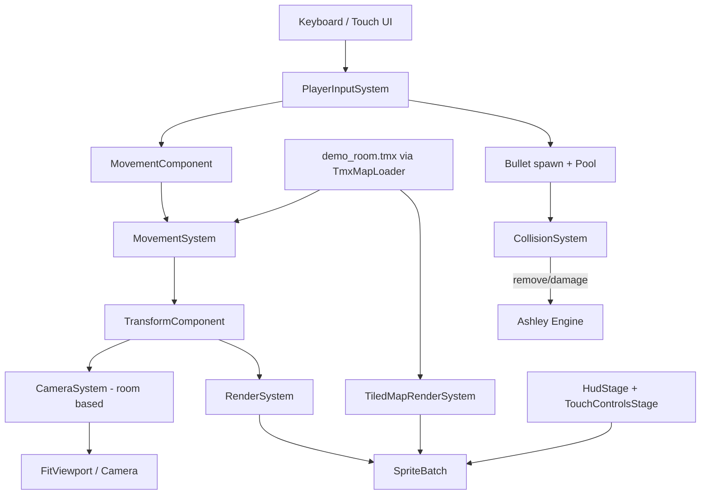

# Requirements

### Overview & Goals
Build a retro 2D side-scrolling, Tiled-map-based, medieval-dungeon platformer on top of the existing empty libGDX multi-platform project (`android`, `ios`, `html`, `lwjgl3`, `core`), following the architecture mandated by `AGENTS.md` and the advanced traversal/combat mechanics mandated by `gameplay.md`. The two reference screenshots (`resources/ideas/img.png`, `resources/ideas/img_1.png`) define the target visual/HUD language: dark-blue brick dungeon rooms, stone-wall foreground platforms, torches, jail windows, chests, a knight statue, a player character with sword, and a mobile HUD/touch-control overlay.

### Scope
**In Scope**
- Ashley ECS engine bootstrap (components + systems) per `AGENTS.md` sections 1-2.
- Tiled (`.tmx`) map loading, static collision-layer parsing, and object-layer entity spawning per `AGENTS.md` section 3.
- A small hand-authored demo `.tmx` dungeon room reproducing the reference screenshots' layer structure (brick background, collision floors/platforms, torches/chests/gate object markers) so the pipeline is exercised end-to-end, using placeholder/programmer-art textures (no final art pack exists yet).
- Room-based flip-screen `CameraSystem` exactly as specified in `AGENTS.md` section E (no smooth follow).
- HUD (hearts, coin counter, item tracker, pause button) and on-screen touch controls (D-pad, A/B/Y) via Scene2D.ui, matching the reference screenshots' layout, wired alongside keyboard input.
- Advanced traversal mechanics from `gameplay.md`: double jump, wall climbing.
- Shooting/combat mechanics from `gameplay.md`: `BulletComponent`, projectile spawning, projectile collision handling, bullet pooling.

**Out of Scope**
- Final production pixel-art assets and tilesets (only placeholder/programmer art is created; real art is a follow-up once supplied).
- Enemy AI behavior systems beyond what's needed to receive bullet damage (no patrol/pathing logic).
- Level design beyond one demo room used to validate systems.
- Save/load, menus, and audio.

### User Stories
- As a player, I can move, jump twice in a row, and cling to walls to traverse dungeon rooms built from Tiled maps.
- As a player, I can shoot projectiles that destroy on wall impact or damage enemies.
- As a player, I see my health (hearts), coin count, and item progress in a HUD matching the reference screenshots, and can control the character via keyboard or on-screen touch buttons.
- As a player, the camera snaps room-to-room (flip-screen) instead of scrolling smoothly, matching classic dungeon-crawler platformers.

### Functional Requirements
- Player entity spawns at the Tiled map's start-gate object marker and can move left/right, jump (single + double), wall-climb, and shoot, with all physics resolved via AABB grid collision against the collision layer.
- HUD top-left shows avatar + heart icons reflecting current health; top-center shows a coin counter (`x 0000` style); top-right shows an item tracker (`x 02/30` style) and a pause button, per the screenshots.
- Touch overlay renders a bottom-left D-pad and bottom-right A/B/Y buttons that drive the same `MovementComponent`/action logic as keyboard input.
- Camera recalculates the active room index from player position each frame and centers on that room only when the room index changes (no per-frame smooth tracking).
- Bullets despawn on wall impact, on enemy impact (after applying damage), or after their lifetime expires; bullet entities are pooled to avoid GC spikes.

# Technical Design

### Current Implementation
The project is a freshly generated libGDX multi-module template (`core`, `android`, `ios`, `html`, `lwjgl3`). `core/build.gradle` already declares `ashley`, `gdx`, `gdx-ai`, `gdx-freetype` dependencies, so no new Gradle dependencies are required for ECS. `Main.java` just calls `setScreen(new FirstScreen())`, and `FirstScreen.java` is an empty `Screen` stub with no rendering, camera, or viewport code. There are no components/systems, no `.tmx` files, and no sprite assets in `assets/` (only `.gitkeep`) — only two reference screenshots under `resources/ideas/`. This is effectively a from-scratch ECS build governed entirely by `AGENTS.md` and `gameplay.md`.

### Key Decisions
Since these were not confirmed with the user, the plan proceeds with the following defaults (called out explicitly so they can be revisited):
- **Build order — foundation first:** ECS/rendering/Tiled/camera scaffolding is built before layering gameplay.md's double jump/wall-climb/shooting on top, since those mechanics depend on a working `MovementSystem` and collision grid.
- **Assets — placeholder art + one hand-authored demo `.tmx`:** Since no real tileset/sprite atlas exists, simple placeholder textures are used and a single small demo room `.tmx` is authored (background/collision/object layers) to exercise the full pipeline, matching the room composition seen in the reference screenshots.
- **Input — keyboard and touch implemented together:** `PlayerInputSystem` reads from both a keyboard handler and the Scene2D.ui touch D-pad/A-B-Y buttons via an `InputMultiplexer`, both writing into the same `MovementComponent`/action flags, since the project targets android/ios/html/lwjgl3 simultaneously.

### Proposed Changes
- Replace `FirstScreen` usage with a `GameScreen` that owns the Ashley `Engine`, an `OrthographicCamera` + `FitViewport` at a fixed virtual resolution (480x270), `TextureFilter.Nearest`, an `AssetManager`, and adds/updates all systems each frame using `Gdx.graphics.getDeltaTime()`.
- Implement core components exactly as named in `AGENTS.md` §2: `TransformComponent`, `TextureComponent`, `AnimationComponent`, `MovementComponent`, `CollisionComponent`, `PlayerComponent` (extended per `gameplay.md` §1A with `jumpCount`, `maxJumps=2`, `isWallClimbing`, `facingDirection`, `shootCooldownTimer`), plus new `BulletComponent` (`damage`, `lifetime`).
- Implement core systems: `PlayerInputSystem`, `MovementSystem` (AABB grid collision + gravity + double jump + wall climb), `AnimationSystem`, `RenderSystem` (z-sorted `SpriteBatch` draw), `TiledMapRenderSystem`/render integration, `CameraSystem` (flip-screen room logic per `AGENTS.md` §E), `CollisionSystem` (bullet-wall/bullet-enemy resolution).
- Build a `MapLoader`/`EntityFactory` that parses the collision tile layer into a static AABB boundary set at load time, and parses object layers to spawn player-start, coin, chest, torch, and exit-gate entities.
- Build a Scene2D.ui `HudStage` (hearts/avatar, coin counter, item tracker, pause button) and `TouchControlsStage` (D-pad, A/B/Y buttons) rendered on top of the game viewport, both reflecting the layouts in `img.png`/`img_1.png`.
- Implement bullet spawning (on B/Y press, respecting `shootCooldownTimer`) using a libGDX `Pool<Entity>` (or equivalent Ashley pooling) per `gameplay.md` §3B to avoid GC stutter.

### Data Models / Contracts
```java
class PlayerComponent implements Component {
  int health; int coins; int items;
  int jumpCount; int maxJumps = 2;
  boolean isWallClimbing;
  int facingDirection; // -1 left, 1 right
  float shootCooldownTimer;
}

class BulletComponent implements Component {
  float damage;
  float lifetime; // despawn after ~1.5s
}

class CollisionComponent implements Component {
  Rectangle bounds;
}
```

### Components
- **`GameScreen`** (new, replaces `FirstScreen` usage in `Main`): owns `Engine`, viewport/camera, `AssetManager`, drives system updates.
- **`PlayerInputSystem`** (new): keyboard + touch input to velocity/action flags, including double-jump trigger and shoot trigger with cooldown.
- **`MovementSystem`** (new): position integration, AABB grid collision resolution, grounded jump-count reset, wall-climb latch/release.
- **`AnimationSystem`** (new): frame selection per state (idle/run/jump/double-jump/wall-climb/attack).
- **`RenderSystem`** (new): z-sorted entity drawing via `SpriteBatch`.
- **`TiledMapRenderSystem`** (new): `OrthogonalTiledMapRenderer` integration, layered correctly with entity rendering.
- **`CameraSystem`** (new): flip-screen room camera per `AGENTS.md` §E formulas, optional lerp transition with input freeze.
- **`CollisionSystem`** (new): bullet-vs-wall and bullet-vs-enemy resolution, entity removal.
- **`HudStage` / `TouchControlsStage`** (new, Scene2D.ui): visual overlay matching the two reference screenshots.

### File Structure
```
core/src/main/java/com/axehigh/platformer/
  Main.java (updated to launch GameScreen)
  screens/GameScreen.java (new)
  ecs/components/{Transform,Texture,Animation,Movement,Collision,Player,Bullet}Component.java (new)
  ecs/systems/{PlayerInput,Movement,Animation,Render,TiledMapRender,Camera,Collision}System.java (new)
  map/MapLoader.java, map/EntityFactory.java (new)
  ui/HudStage.java, ui/TouchControlsStage.java (new)
assets/
  maps/demo_room.tmx (new demo map, hand-authored)
  gfx/*.png (new placeholder textures)
```

### Architecture Diagram


### Risks
- Without final art assets, placeholder textures/demo map will need to be swapped later; keep texture regions and map layer names decoupled from hardcoded asset paths where practical.
- Wall-climb and double-jump interact with the same grounded/jump-count state; care is needed in `MovementSystem` ordering to avoid conflicting resets in the same frame.
- Room-based camera transitions (freeze + lerp) must not desync from Tiled map room boundaries if map dimensions aren't exact multiples of the virtual resolution.

# Testing

### Validation Approach
Since no automated test harness exists yet, validation relies on building the project (`./gradlew :core:compileJava`, `:lwjgl3:run` where possible) and manual/log-driven checks against the demo map and reference screenshots.

### Key Scenarios
- Engine boots into `GameScreen`, loads `demo_room.tmx`, and renders background/collision/object layers with the player spawned at the start-gate marker.
- Player can walk, jump, double-jump (verify `jumpCount` resets to 0 on landing), wall-climb against a marked wall tile, and shoot a bullet that despawns on wall or enemy impact.
- HUD reflects health/coin/item values from `PlayerComponent`, and touch D-pad/A/B/Y buttons produce the same effect as keyboard equivalents.
- Camera jumps discretely between rooms only when `roomX`/`roomY` changes, never scrolling smoothly.

### Edge Cases
- Player jumping at a room boundary while a bullet is in flight (verify bullet position isn't affected by camera room switch).
- Rapid-fire shooting requests while `shootCooldownTimer > 0` are ignored, not queued.
- Wall-climb release when the player reaches the bottom of a wall tile or presses away from the wall mid-climb.

# Delivery Steps

### ✓ Step 1: Bootstrap Ashley ECS engine, viewport, and rendering pipeline
GameScreen replaces FirstScreen and drives a working Ashley Engine with a fixed-resolution viewport.
- Implement `TransformComponent`, `TextureComponent`, `AnimationComponent`, `MovementComponent`, `CollisionComponent`, `PlayerComponent` (base fields only).
- Implement `RenderSystem` (z-sorted SpriteBatch draw) and `AnimationSystem` (state-driven frame selection).
- Create `GameScreen` with `FitViewport` at 480x270, `TextureFilter.Nearest`, `AssetManager`, and delta-time-driven engine update loop.
- Update `Main.java` to launch `GameScreen` instead of `FirstScreen`.
- Add placeholder textures under `assets/gfx/` for the player and a simple tile.

### ✓ Step 2: Integrate Tiled maps and static collision loading
A demo dungeon room loads from a .tmx file with background, collision, and object layers.
- Author `assets/maps/demo_room.tmx` reproducing the reference screenshots' layer structure (brick background, stone floor/platform collision tiles, object markers for start gate, exit gate, torches, chest, coins).
- Implement `TiledMapRenderSystem` using `TmxMapLoader`/`OrthogonalTiledMapRenderer`, integrated so background draws behind entities and foreground (if any) draws above.
- Implement `MapLoader`/`EntityFactory` that reads the collision layer into a static AABB boundary set at load time and parses object layers to spawn player-start, coin, chest, torch, and exit-gate entities.

### ✓ Step 3: Implement player movement, grid collision, and room-based camera
The player character moves, jumps once, and collides correctly with the demo map, with a discrete flip-screen camera.
- Implement `PlayerInputSystem` reading keyboard input into `MovementComponent`/facing direction.
- Implement `MovementSystem` with AABB grid collision resolution against the static boundary set, gravity, and single jump with grounded reset.
- Implement `CameraSystem` per `AGENTS.md` §E: compute `roomX`/`roomY` from player position and snap camera center to the room, with no smooth per-frame tracking (optional freeze+lerp transition on room change).

### ✓ Step 4: Build HUD and on-screen touch controls
The reference screenshots' HUD and mobile control overlay render and drive the same input path as the keyboard.
- Implement `HudStage` (Scene2D.ui): top-left avatar + heart icons bound to `PlayerComponent.health`, top-center coin counter bound to `coins`, top-right item tracker + pause button bound to `items`.
- Implement `TouchControlsStage`: bottom-left D-pad, bottom-right A/B/Y buttons, wired via `InputMultiplexer` into the same `PlayerInputSystem` handlers used by keyboard.
- Layer both stages above the `FitViewport` game render without disturbing the virtual-resolution scaling.

### ✓ Step 5: Add double jump and wall climbing mechanics
Player can double jump and cling/wall-jump per gameplay.md, with correct state resets.
- Extend `PlayerComponent` with `jumpCount`, `maxJumps=2`, `isWallClimbing`, `facingDirection`, `shootCooldownTimer`.
- Extend `PlayerInputSystem`/`MovementSystem` to allow a second jump while airborne, incrementing `jumpCount`, and reset it to 0 on grounded contact.
- Implement wall-detection AABB probe in `MovementSystem`: latch (`isWallClimbing=true`, reduced fall speed, `jumpCount=1`) when moving into a wall while airborne and holding toward it; release on opposite input or falling past the wall tile.
- Update `AnimationSystem` to trigger distinct jump/double-jump/wall-climb animation states.

### ✓ Step 6: Implement shooting and pooled bullet collision system
Player can fire projectiles that despawn correctly and avoid GC churn under heavy fire.
- Implement `BulletComponent` (`damage`, `lifetime`) and bullet entity spawning in `PlayerInputSystem` on B/Y press, gated by `shootCooldownTimer`, offset/velocity based on `facingDirection`.
- Implement `CollisionSystem` handling bullet-vs-collision-layer impact (remove bullet) and bullet-vs-enemy-entity impact (apply damage, remove bullet), plus lifetime-based despawn.
- Add a `Pool`-based (or Ashley pooled component) bullet reuse mechanism to avoid per-shot allocation during heavy combat sequences.